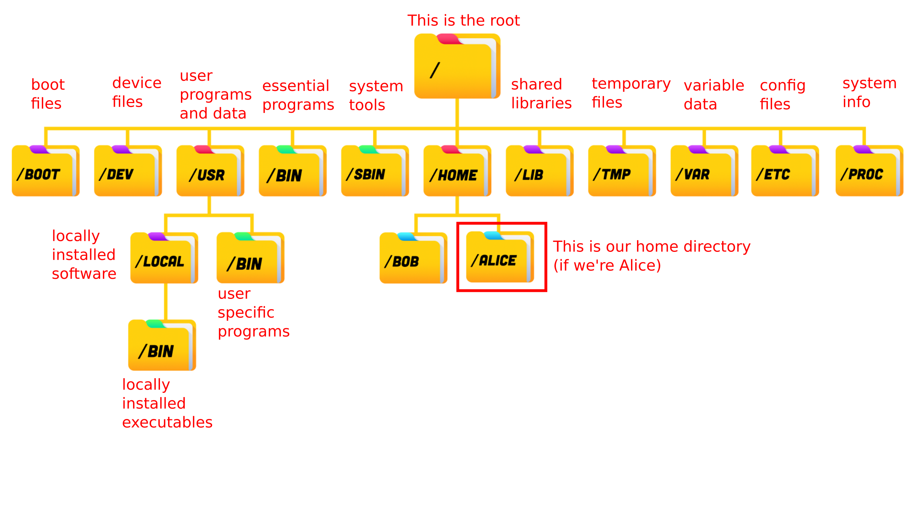
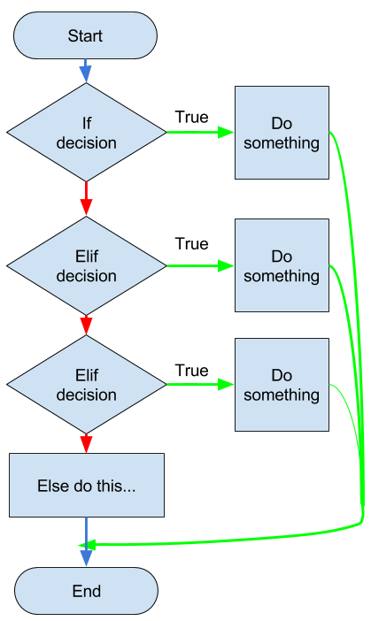
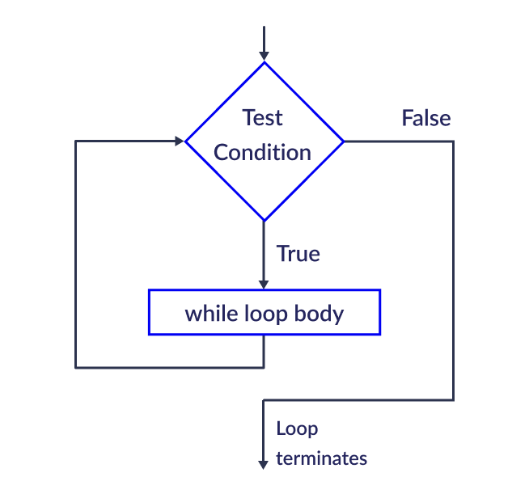
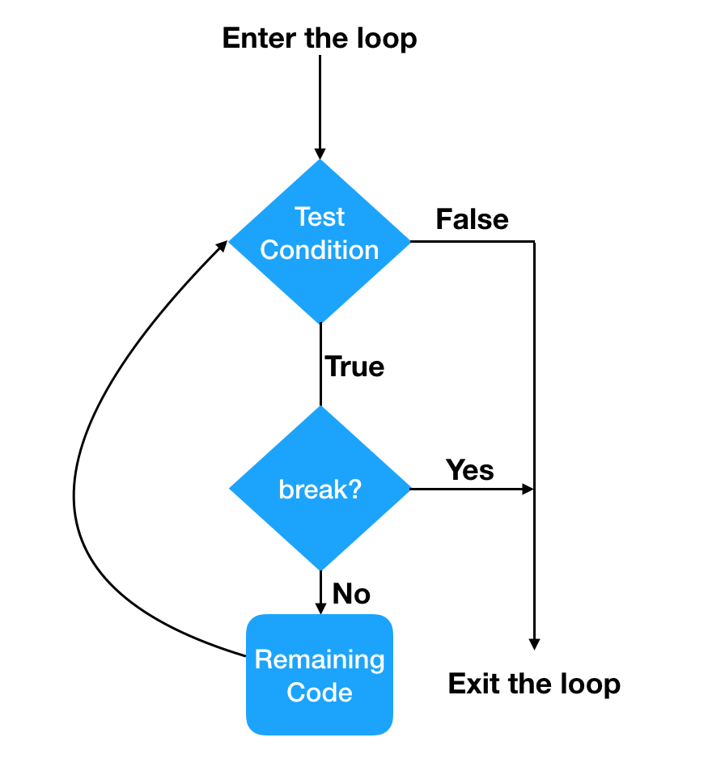
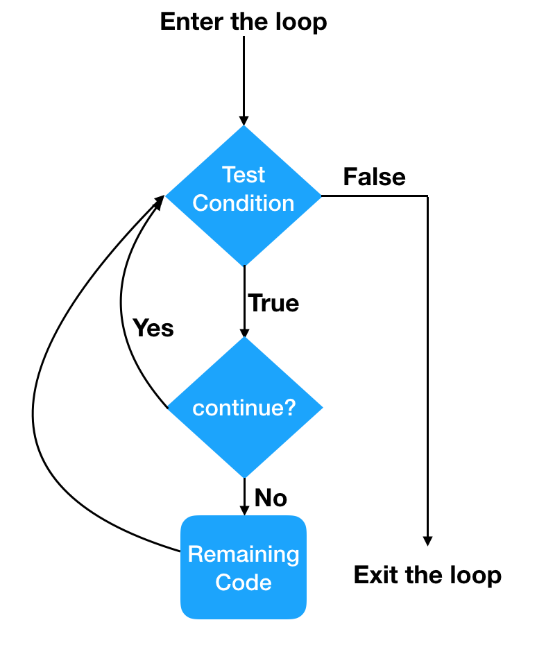

<!-- style: |
  section {
    font-family: "Helvetica", serif;
  }
-->


# Python Beginners Bootcamp
## Universität Potsdam
### Winter 2025

```python
print("Hello world!")
```
<br>

###### Dr. Natalie Williams  
###### natalie.williams@uni-potsdam.de
---
## Logistics
- This course is a one week intensive course designed to teach basic Python programming for scientists
- The course is aimed at complete beginners to Python or programming in general, those who know another language, or just those that want to brush up 
- Each day will consist of two sessions: one from 10:15 - 12:30, and one from 13:15 - 15:30
- All sessions will take place here in room xxx

---
## Logistics
- Each session will be lecture style for ~45 mins, followed by hands on coding for the remaining hour where I will be available to help
- Material is available on moodle, and you may use the computers here or your own personal laptop (may require extra setup)
- You are encouraged to work together with your neighbour, and to google things ([stackoverflow](https://stackoverflow.com/questions) is your friend)
- This is the first time this course is being delivered, so please ask questions where needed. We can slow things down as much as we need.

---
## Course content

#### What this course will cover
- Basic shell usage, conda and virtual environments
- Python basics: Variables, input/output, operators, data types
- Control flow: conditional statements, boolean logic, error handling
- Loops, strings, functions and classes
- Data structures: Lists, tuples, dictionaries, sets
- Plotting with `matplotlib`
- Modules: `numpy`, `scipy`
---
#### What this course won't cover
- Shell scripting
- Binary and computer memory allocation
- Linux system administration or remote access tools
- Advanced Python (generators, lambda functions, decorators)
- Graphical user interfaces or animations
- Modules such as `pandas`, `seaborn`
- Using git

This is a course in Python *for scientists* **not** computer programmers, so we will focus on the practical aspects of Python.

---
## What is Python?
- Python is a high level, interpreted programming language
- As an interpreted language it is easy to run and does not require a separate compiler such as with C/C++
- It is known for its ease of use and clear syntax
- Python is widely used in the scientific community, particularly for data analysis
- Python lets you use packages and code written by others easily, so you can build powerful programs without starting from scratch
---
### 
### Pros of Python
- Easy to read and write, very intuitive and easily debugged
- Huge community and libraries available
- Versatile, used in many industries
### Cons of Python 
- Slower than compiled languages such as C/C++
- Can be inefficient with memory
- Dynamically changing libraries can lead to outdated code
---
# Session 1: Using the Terminal
```bash
williams@Natalie:~$ pwd
/home/williams

williams@Natalie:~$ ls
mycode.py  Documents    

williams@Natalie:~$ mkdir Computing

williams@Natalie:~$ cd Computing

williams@Natalie:~/Computing$ touch mynotes.txt
```
---
## The terminal
- Before we look at Python, we need to understand how to navigate our computer system using the **terminal**
- The terminal is a text based interface which allows us to interact with the computer
- This may seem unnecessary when we have a file explorer - however using the terminal provides much more flexibility, and as you become proficient at coding it will become easier and necessary to use the terminal
---
## Opening the terminal
Linux & macOS:
Search in applications for "Terminal"

Windows:
Search in applications for "Powershell" or "Windows Terminal"
Download WSL (once) with 
```bash
wsl --install
```
Open WSL from Powershell or Windows Terminal with
```bash
wsl
```
---
## Where am I?
- When opening the terminal, we see the **command line**
- In the command line it shows `user_name@computer_name:location$`
```bash
Natalie@mylinux:~$
```
- We are in a location, our home **directory** (folder), denoted by `~`.
- To check where you currently are in the file system, you can use the command  `pwd` to print our current location (or **path**)

```bash
Natalie@mylinux:~$ pwd
/home/Natalie
```

---

## The file system



---
## Commands
- We will explore some of the most useful **commands** that can be used on the command line and their functionality
- Each command may have many options, these can be listed for most commands by using `man *command*` or `*command* --help`

```bash
Natalie@mylinux:~$ pwd --help
```
```bash
Natalie@mylinux:~$ man pwd
```
- **Top tip**: Use the up and down arrowkeys to cycle through previous commands rather than typing them out again
---

## Looking around
<style>
.term-dir { color: blue; }
.term-exe { color: green; }
.term-zip { color: red; }
.term-symlink { color: orange; }
.term-hidden { color: gray; }
</style>

- The contents of the location we are in can be viewed with `ls`

```bash
Natalie@mylinux:~$ ls
Documents   mycode.py  
```
- These file types are colour-coded as normal files, <span class="term-dir">documents</span>, and <span class="term-exe">executable files</span>.
- Hidden files (files/directories that start with `.` and are hidden from the user) can be shown with `ls -a`

```bash
Natalie@mylinux:~$ ls -a
.  ..  .bashrc mycode.py  Documents  .jupyter  .ssh
```

---

## Looking around

- To view more details on the files we use `ls -l` with form 
```
permissions | # of hard links | Owner | Group | File size (bytes)| Last modified | Name
```
```bash
Natalie@mylinux:~$ ls -l
drwxr-xr-x  6 Natalie Natalie    4096 Feb 20 14:32  Documents
-rw-rw-r--  1 Natalie Natalie       5 Mar 27 14:34  mycode.py
```
- Permissions are laid out as d<span class="term-dir">rwx</span><span class="term-exe">rwx</span><span class="term-zip">rwx</span> where d - directory, r - read, w - write, x - execute for <span class="term-dir">user</span>, <span class="term-exe">group</span> and <span class="term-zip">others</span> users
- Permissions can be changed with `chmod` i.e., `chmod u+x mycode.py`
---
## Moving around
- To move to another directory from your current location use `cd`

```bash
Natalie@mylinux:~$ cd Documents
Natalie@mylinux:~/Documents$ ls
Computing    myfile1.txt    myfile2.txt
```
- **Top tip**: use tab to autocomplete file and directory names
- We denote one directory back with `..`, and the current with `.` 
```bash
Natalie@mylinux:~/Documents$ cd ..
Natalie@mylinux:~$ cd .
Natalie@mylinux:~$
```

---

## Moving around
- When only running `cd`, it takes you back to your home directory, this is the equivalent of `cd ~`
- We can pass **relative paths** from the current position

```bash
Natalie@mylinux:~$ cd Documents/Computing
Natalie@mylinux:~/Documents/Computing$ cd ../Computing
```
- We can also pass **absolute paths** to anywhere on system
```bash
Natalie@mylinux:~$ cd /home/Natalie/Documents/Computing
Natalie@mylinux:~/Documents/Computing$ cd ~/Documents
Natalie@mylinux:~/Documents$ cd /usr/bin
```
---
## Creating and deleting directories
- We make new directories using `mkdir` 
```bash
Natalie@mylinux:~$ mkdir Masters
Natalie@mylinux:~$ ls
Documents   Masters   mycode.py  
Natalie@mylinux:~$ cd Masters
Natalie@mylinux/Masters:~$
```
- Directories can be deleted with `rm -r` (only need `rm`  for files)
```bash
Natalie@mylinux:~$ rm -r Masters
Natalie@mylinux:~$ ls
Documents   mycode.py
```
---
## Copying and moving files/directories
- We can copy a file/directory using `cp` 
```bash
Natalie@mylinux:~$ cp mycode.py ./Documents
Natalie@mylinux:~$ ls ./Documents
Computing    mycode.py    myfile1.txt    myfile2.txt 
Natalie@mylinux:~$ cp mycode.py mycode_copy.py
Natalie@mylinux:~$ ls
Documents   mycode.py   mycode_copy.py 
```
- We can move/rename a file/directory with `mv`
```bash
Natalie@mylinux:~$ mv mycode.py ./Documents/Computing
Natalie@mylinux:~$ mv mycode_copy.py mycode_renamed.py
```

---
## Creating files and text editing
- We can create a new file with `touch`
```bash
Natalie@mylinux:~$ touch newfile.txt
Natalie@mylinux:~$ ls
Documents   mycode.py   newfile.txt
```
- We can also create a file using a text editor (emacs, nano, vim)
```bash
Natalie@mylinux:~$ vim newfile.txt
Natalie@mylinux:~$ emacs newfile.txt &
```
Here vim opens in the terminal, emacs in the background (with `&` )

---
## Using vim
- We use vim as an example - after opening the file press `i` to start editing
```bash
This is my text file


--INSERT--                                                   1,1         All
```
- After finishing press `esc` and enter `:wq` to write and quit, or `:q!` to quit without saving and go back to the terminal
- Vim can be used to write Python files with, i.e. `vim myscript.py`

---

# Session 2: Python basics
```python
# Calculate adjusted travel time to the ISS

name = input("Astronaut name: ")
speed = int(input("Speed in km/s: "))
distance = 400
time = distance / speed

time += 2  # docking delay
print(f"ETA for {name[:3]}: {time}")

```
---
## Installing python
Everything for this course is set up on the lab computers, however you can do the exercises on your personal laptops if you wish.

You will need to make sure Python is installed - you can download Python [here](https://www.python.org/downloads/).

All exercises will be done through jupyter notebooks - for now this is easiest done by downloading and launching [Anaconda navigator](https://www.anaconda.com/products/navigator).

---
## How does Python run code?
- Python execute your code **one line at a time**, from top to bottom
- This means
```python
This line runs first
Then this one
And so on...
```
- If there's an error on a line, Python **stops running**, and shows an error, reading no more code
- This makes it easy for us to debug code

---
## Ways to run Python
- On the terminal line by line
```bash
Natalie@mylinux:~$ python
>>> print('Hello world')
Hello world
```
- Through a prewritten python script (`.py` file) via the terminal
```bash
Natalie@mylinux:~$ python myscript.py
```
- Through an interactive development environment (Spyder, PyCharm, Visual Studio Code, Jupyter notebooks/lab)
---

## Print
- The `print()` function displays output to the screen
- You can print text, numbers or variables
- Use quotes `""` or `''` for text (strings)
```python
print('Hello world!') 
```
Output: 

```bash
Hello world!
```

---

## Comments
- Comments allow us to add text to our code which is **not read** by the code
- This allows us to explain what the code is doing, which is very useful for long and complex code
- You are **highly encouraged** to comment your code - both for yourself looking back at code and anyone marking your code to understand what you did
- Comments are added by inserting a `#` followed by the comment
```python
print('Hello world!') # This line outputs 'Hello world!'
```

---
## Variables
- Variables are names chosen by the coder to store values
- We **assign** values to variables with `=`
- Variable names can include letters, numbers and underscores, but **cannot** start with a number or contain spaces
- Variables can be overwritten (be careful!)
- Multiple variables can be assigned at once
```python
x = 5
y, z = x, 0.3
x = 2
print(x, y, z) # This will print: 2 5 0.3
```
---
## Data Types
- There are several distinct data types we use in Python
- These include `int` (integers), `float` (decimals), `string` (text), `bool` (true or false)
- We can convert data types where allowed

```python
x = 5 # int -> integer
factor = 2.4 # float -> decimal
greeting = 'hello' # string -> text
mybool = True

y = 2. # this is a float = 2.0
a = 1.5e-3 # this is a float = 0.0015
```
---
## Casting
- We can specify the data type we would like, and where allowed, convert between them
```python
x, y, z = int(3), int(2.8), int('5') # x is 3, y is 2, z is 5  

x, y, z = float(3), float(2.8), float('5') # x is 3.0, y is 2.8, z is 5.0

x, y, z = str('hello'), str(3), str(2.8) # x is 'hello', y is '3', z is '3.8'

x = 4.7
y = int(x) # y is 4
z = 'hello'
int(z) # raises ValueError -> letters cannot be converted to numbers
```
---
## Operations
- Python is built in with simple operations
- These include add `+`, minus `-`, times `*`, divide `/`, power `**`, modulus (remainder)`%` and floor division `//`

```python
x = 5
y = (6 - x)**2 / x # y is 0.2
z = y + x # z = 5.2
```

Note that during operations data types may be implicitly converted i.e. `x` is implicitly converted from `int` to `float` in this last line

---

## Assignment operators
- In this previous slide the variables are never altered (`x` stays 5, `y` stays 0.2 etc)
- Variables can be altered, this is commonly done with assignment operators which take the form `*operator*=`

```python
x = 5
x +=3 # equivalent to x = x + 3, x is now 8
x *=2 # equivalent to x = x * 2, x is now 16
x //= 3 # equivalent to x = x // 3, x is now 5
```
---

## Conditional Operators
- Conditional operators are used to compare values
- They return a **boolean** (data type `bool`) value `True` or `False`, which if treated as integers are equal to 1 and 0 respectively
- Examples include equal `==`, not equal `!=`, greater than `>`, less than `<`, greater or equal to `>=`, less than or equal to `<=`
```python
x, y = 5, 5.0
x == y # True -> implicitly converts x to a float to compare
x <= 10 # True
greeting, another_greeting  = 'hello', 'hello '
greeting == another_greeting # False - how are they not the same?
a = x != greeting # a = True, we are allowed to compare different data types
```

---
## Logical Operators
- Logical operators combine conditional operators
- These are `and` (returns `True` if both statements are true), `or` (returns `True` if one statement is true) and `not` (reverses the result, returns `False` if `True` and vice versa)

```python
x, y = 2, 7
x < 5 and y > 5 # True
x >= 10 or y != 3 # True
not(x >= 10 and y != 3) # False
```

---
## Indexing strings
- We can also use the `+` operator to concatenate strings
```python
name, message = 'Natalie', 'Hello, '
greeting = message + name + '!'
print(greeting) # 'Hello, Natalie!'
```
- We use `stringname[i]` to **index** the i-th component of a string
- **Important**: In Python indexing starts a 0, **not** 1
```python
print(name[0]) # first component -> 'N'
print(name[2]) # third component -> 't'
print(name[-1]) # last component -> 'e'
print(name[-3]) # third last component -> 'l'
```
---

## Slicing strings
- Slicing can be used to index multiple components of a string with notation `stringname[start:stop:step]` with defaults of `start = 0`, `stop = -1` and `step = 1`
```python
name = 'Natalie'
print(name[2:5]) # 3rd to 5th -> 'tal'
print(name[:5]) # 1st to 5th -> 'Natal'
print(name[5:]) # 5th to end -> 'ie'
print(name[1:6:2]) # every 2nd letter 2nd to 7th -> 'aai'
print(name[::3]) # every 3rd letter -> 'Nae'
```
- We can also use `len` to get the length of a string i.e. `len(name`)

---
## Modifying strings
- Here is a selection of useful **methods** used to modify strings
```python
x = ' Hello, World! '

print(x.upper()) # returns string in upper case -> ' HELLO, WORLD! '

print(x.lower()) # returns string in lower case -> ' hello, world! '

print(x.strip()) # removes whitespace -> 'Hello, World!'

print(x.replace('H', 'J')) # replaces one string with another -> ' Jello, World! '

print(x.split(',')) # returns a list of strings split by ',' -> '[' Hello', 'World! ']'

```

---
## Formatting strings
- We can combine strings and numbers easily by using **f-strings**
- This requires `f` to be placed before the string, and number variables placed as `{num}`
```python
num = 42
txt = f'The answer to Life, the Universe and Everything is {num}'
print(txt) # 'The answer to Life, the Universe and Everything is 42'
```
- Specify the number `n` of decimals to display `x` with `x:.nf`
```python
pi = 3.14159265359
print(f'Pi is {pi:.2f}') # 'Pi is 3.14'
```

---
## User input
- We use the function `input` to take an input from the user
```python
name = input('Enter your name')
print(f'Hello {name}')
```
- Input **always** takes the input as a string, so if you require a number this needs to be manually converted
```python
x = input('Enter a number')
print(x + 5) # returns TypeError: can only concatenate str (not "int") to str
x = int(input('Enter a number'))
print(x + 5) # returns expected value
```
---
# Session 3: Lists, Tuples, Sets & Dictionaries

```python
planets = ["Mercury", "Venus", "Earth"]
constellations = ("Orion", "Cassiopeia", "Lyra")
observatories = {"ALMA", "Keck", "VLT", "ALMA"}
galaxy = {"name": "Andromeda", "distance": 2.5}

planets.append("Mars")
print(constellations[1])
print(observatories)
print(galaxy["distance"])
```
---
## Lists 
- Lists are an **ordered**, **mutable** collection (can be changed after it has been created) denoted by square brackets

```python
planets = ["Mercury", "Venus", "Earth"]
series = [2 , 8 , 3 , 4]
```
- Lists can be indexed and sliced to obtain values
```python
print(planets[2]) # 'Earth'
print(series[1:3]) # [8 , 4]
```
---
## Changing and adding to lists 
- Lists can be changed using indexing

```python
planets[1] = 'Mars'
print(planets) # ['Mercury' , 'Mars' , 'Earth']
```
- We add single values to the end with the `append` method, inserted in specific positions with `insert`, and concantenate lists together with `extend` or `+`
```python
planets.append('Jupiter')
planets.insert( 1 ,'Venus')
planets.extend(['Saturn', 'Neptune'])
print(planets) # ['Mercury' , 'Venus' , 'Mars' , 'Earth', 'Jupiter' , 'Saturn' , 'Neptune']
```

---
## Removing from lists 
- Items are removed by value with `remove` (removes first item of this value) and index with  `pop`

```python
planets.remove('Earth')
planets.pop(3)
print(planets) # ['Mercury' , 'Venus',  'Mars' , 'Saturn' , 'Neptune']
```
- Lists are mutable, so methods change them directly; string methods return new strings instead of changing the original.
```python
mystring = 'Hello'
mystring[0] = 'J' # TypeError: 'str' object does not support item assignment
```

---

## Lists properties
- Different data types can be combined in one list, and values can be repeated

```python
mylist = ["banana", 4 , 1.8e-7 , "banana"]
```
- Other useful **functions** (do not change the list) include
```python
x = [2, 6, -3, 8]
print(len(x)) # length of list -> 4
print(sum(x)) # sum if numeric -> 16
print(min(x)) # minimum if numeric -> -3
print(max(x)) # maximum if numeric -> 8
```
---

## Tuples

- A tuple is a collection which is ordered and **unchangeable**, written with round brackets
```python
planets = ("Mercury" , "Venus" , "Earth")
```
- We cannot change, add or remove items from a tuple
- Multiple entires with the same value are allowed
```python
planets = ("Mercury" , "Venus" , "Earth" , "Venus")
```
---

## Creating tuples
- Tuples can be created with one item but **must** contain a `,`
```python
planets = ("Earth") # NOT a tuple
planets = ("Earth",) # a tuple
```
- Tuples can contain any and multiple data types
```python
mytuple = ("Earth" , 5 , True , 3.46e5)
```
- `len` can still be used to obatain a tuple length
```python
print(len(mytuple)) # 4
```
---

## Accessing tuples
- Values in tuples can still be indexed and sliced
```python
planets = ("Mercury" , "Venus" , "Earth" , "Mars")
print(planets[2]) # "Earth"
print(planets[1:-1]) # ("Venus" , "Earth")
```
- You can add a tuple to a tuple with `+`
```python
x = ("Jupiter",)
planets += x
print(planets) # ("Mercury" , "Venus" , "Earth" , "Mars" , "Jupiter")
```
---

## Unpacking tuples
Tuples can be **unpacked** to extract the individual values back into variables
```python
planets = ("Mercury" , "Venus" , "Earth")
(planet1 , planet2 , planet3) = planets
print(planet1) # "Mercury"
```
- Multiple variables can be unpacked with `*`
```python
(planet1 , *other_planets) = planets
print(other_planets) # ("Venus" , "Earth")
```
---
 ## Sets
 - A set is an **unordered, unindexed** collection denoted with curly brackets `{}`
 ```python
planets = {"Mercury" , "Venus" , "Earth"}
print(planets) # {'Mercury', 'Earth', 'Venus'}
```
- Sets can contain all data types, but other collections, sets **do not** allow multiple entries with the same value
 ```python
myset = {"Mercury" , "Venus" , "Earth" , "Mercury", 7.3 , 1 , True, False}
print(myset) # {False, 1, 'Earth', 'Mercury', 7.3, 'Venus'}
```
---
 ## Acessing sets
 - As they are unordered, sets cannot be indexed and can only be accessed by a loop (next session)
 - We can use `in`/`not in` to check if an entry is in/not in a set
 ```python
planets = {"Mercury" , "Venus" , "Earth"}
print("Earth" in planets) # True
print("Venus" not in planets) # False
```
---
 ## Adding and removing from sets
- Set elements cannot be changed but sets can be added to with the `add` method 
 ```python
planets = {"Mercury" , "Venus" , "Earth"}
planets.add("Mars")
print(planets) # {"Mars" , "Mercury" , "Earth" , "Venus"}
```
- Items can be removed with either the `remove` or `discard` method
 ```python
planets.remove("Venus")
planets.discard("Mars")
print(planets) # {"Mercury" , "Venus"}
```
---
 ## Joining sets
- There are various method to join sets
 ```python
planets1 = {"Mercury" , "Venus" , "Earth"}
planets2 = {"Venus" , "Earth" , "Mars"}

print(planets1.union(planets2)) 
# joins items from both sets ->  {'Earth', 'Venus', 'Mercury', 'Mars'}
print(planets1.intersection(planets2)) 
# joins but keeps only duplicates -> {'Earth', 'Venus'}
print(planets1.difference(planets2)) 
# keeps itens in first set not in the second ->  {'Mercury'}
print(planets1.symmetric_difference(planets2)) 
# keeps all except duplicates -> {'Mercury', 'Mars'}
```
---
## Dictionaries

- Dictionaries are **ordered, changeable** collections
- Denoted with curly brackets with key: value pairs `{key:value}`
```python
Mars = {
  "Radius": 3389.5,
  "Colour": "Red",
  "Temperature": -65 }
print(Mars) # {'Radius': 3389.5, 'Colour': 'Red', 'Temperature': -65}
```
- Since they are unordered, dictionaries cannot be indexed
```python
print(Mars[0]) # KeyError: 0
```
---
## Dictionaries
- Duplicate entries will overwrite existing values
```python
Mars = {
  "Radius": 3389.5,
  "Colour": "Red",
  "Temperature": -65, 
  "Colour": "Blue" }
print(Mars) # {'Radius': 3389.5, 'Colour': 'Blue', 'Temperature': -65}
```
- Dictionary keys can also be numbers

```python
mydict = {0: 1}
print(mydict)  # {0: 1}
```
---
## Accessing dictionaries
- Items are accessed with `dict_name["key_name"]`
```python
Mars = {
  "Radius": 3389.5,
  "Colour": "Red",
  "Temperature": -65 }
print(Mars["Colour"]) # 'Red'
```
- Key names can be listed with `keys`, and values with `values`
```python
print(Mars.keys()) # dict_keys(['Radius', 'Colour', 'Temperature'])
print(Mars.values()) # dict_values([3389.5, 'Red', -65])
```
---
## Editing dictionaries
- Dictionaries can be added and changed with an assigment
```python
Mars["Period"] = 687
Mars["Colour"] = "Blue"
print(Mars) # {'Radius': 3389.5, 'Colour': 'Blue' , 'Temperature': -65, 'Period': 687}
```
- Entries can be deleted with the `pop` method
```python
Mars.pop("Period")
print(Mars) # {'Radius': 3389.5, 'Colour': 'Blue' , 'Temperature': -65}
```
---
## Editing dictionaries
- Dictionaries can be copied with the `copy` method
```python
Mars_2 = Mars.copy()
```
- You **cannot** copy dictionaries through assignement ie ` Mars_2 = Mars` as any changes to one will change the other

---
## Nested dictionaries
- Dictionaries can be **nested** 
```python
planets = {
  "Mercury" : {
    "Radius" : 2439,
    "Mass" : 3.285e23 },
  "Venus" : {
    "Radius" : 6052,
    "Mass" : 4.867e24 },
  "Earth" : {
    "Radius" : 6378,
    "Mass" : 5.972e24
  }
}
```

---
## Nested dictionaries
- To access the items in a nested dictionary, use the key names moving outside in
```python
print(planets["Venus"]["Radius"]) # 6052
```
- Again we can use `len` to get the length of a dictionary
```python
print(len(Mars)) # 3
```
---

<table border="0" cellpadding="0" cellspacing="0" style="border-collapse: collapse; text-align: left; font-size: 14px;">
  <thead style="background-color: #f2f2f2;">
    <tr>
      <th>Property</th>
      <th>List</th>
      <th>Tuple</th>
      <th>Set</th>
      <th>Dictionary</th>
    </tr>
  </thead>
  <tbody>
    <tr>
      <td><strong>Syntax</strong></td>
      <td>[1, 2, 3]</td>
      <td>(1, 2, 3)</td>
      <td>{1, 2, 3}</td>
      <td>{"a": 1, "b": 2}</td>
    </tr>
    <tr>
      <td><strong>Ordered</strong></td>
      <td>Yes</td>
      <td>Yes</td>
      <td>No</td>
      <td>Yes (Python 3.7+)</td>
    </tr>
    <tr>
      <td><strong>Indexed</strong></td>
      <td>Yes</td>
      <td>Yes</td>
      <td>No</td>
      <td>By key</td>
    </tr>
    <tr>
      <td><strong>Mutable</strong></td>
      <td>Yes</td>
      <td>No</td>
      <td>Yes</td>
      <td>Yes</td>
    </tr>
    <tr>
      <td><strong>Allows Duplicates</strong></td>
      <td>Yes</td>
      <td>Yes</td>
      <td>No</td>
      <td>Keys: No<br>Values: Yes</td>
    </tr>
  </tbody>
</table>


---

# Session 4: Control Flow & Error Handling  
```python
numbers = [10, -5, 0, 23, -1]

for n in numbers:
    if n > 0:
        print(f"{n} is positive")
    elif n < 0:
        print(f"{n} is negative")
    else:
        print("Zero found")
```
---
## `if`, `elif` and `else`

- We can combine the conditional statements we saw in session 2 (i.e. `==`, `<`, `>`)with `if`, `elif` and `else` statements to selectively evaluate blocks of code such as
```python
if *some condition evaluates true *:
  *do something*
elif *some other condition evaluates true*:
  *do a different thing*
else:
  *do yet another different thing* 
```
---
## `if`, `elif` and `else`
- If a statement evaluates to `True`, the indented code block is ran, and skipped otherwise
```python
print(5 > 0) # True
print(5 == 6) # False

if 5 == 6:
  print('This is True') # This would not run as 5 == 6 is False
elif 5 > 3:
  print('This is True') # This would run as 5 > 3 is True 
elif 5 == 5:
  print('This is True') # This would not run as the clause above was already fulfilled
else:
  print('Neither of these were True') # This would not run as one of the above was True
```
---
## Aside: a note on indentation
- Notice that after the `if`/`elif`/`else` statements there is an indent - this is not style but **necessary**
```python
x = 5
if x > 0:
  print('checking...') # this will run fine
  print('positive number') # both these lines are in the same code block and will run together
print('moving on...') # this will run regardless - outside of the if code block

if x > 0:
print('positive number') # This will raise an IndentationError
```
- We call the indented section a **code block** as it is a group of lines that are run together
---
## `if`, `elif` and `else`
- In a series of `if`, `elif` and `else` statements, if one is `True `, the rest are skipped
```python
number = 8
if number > 5:
  print("Number is greater than 5")
elif number % 2 == 0:
  print("Number is even")
elif number > 10:
  print("Number is greater than 10")
else:
  print("Number is 5 or less and odd")
# prints only the first one -> Number is greater than 5
```
---
## `if`, `elif` and `else`
- Alternatively a series of only `if` statements, they are run separately
```python
number = 8
if number > 5:
  print("Number is greater than 5")
if number % 2 == 0:
  print("Number is even")
if number > 10:
  print("Number is greater than 10")
# prints each one it fulfills -> Number is greater than 5    Number is even
```
---
## `if`, `elif` and `else`
- We can use logical operators as well as conditional operators in  our statements
```python
number = 5
if number % 2 == 0 and number > 10: # runs if both conditions evaluate to True
  print(f"{number} is even and greater than 10") # this does not run
elif number % 2 != 0 or number == 10: # runs if at least one condition evaluates to True
  print(f"{number} is either odd or exactly 10") # this runs
elif not number > 0:
  print(f"{number} is negative")  # runs if condition is not True
else: # runs if neither of the above were fulfilled
  print(f"{number} does not match the above conditions") # this does not run
```
---
## `while` loops

- `while` loops repeat a block of code whilst some condition is `True`
```python
i = 1
while i < 10: # runs code block while this is True
  print(f'{i} is less than 10')
  i += 1
```
- Warning: without proper care while loops can run infinitely! (cancel with a) terminal: `Ctrl+C`, b) jupyter: restart kernel)
---
## `break` statements

- We can force the loop to end with a `break`  statement
```python
number = 1

while number <= 5:
  print(f"Number is: {number}")
    
  if number == 3:
    print("Stopping the loop early!")
    break  # exit the loop completely immediately
    print("That was a break!") # this will never run!
    
  number += 1 # pay attention to indents
  # this runs outside of the if, but inside the while
```
---
## `break` statements
- We can use break statements to exit an otherwise infinte loop
```python
count = 0

while True: # this forms an infinite loop as it will always be True
  print(f"Loop number: {count}")
  count += 1

  if count == 5:
    print("Reached 5, breaking the loop.")
    break  # Exit the infinite loop
```
---
## `continue` statements

- We can force a loop to skip the rest of it's block and return to the start with `continue`
```python
i = 0 
while i < 10:
  i += 1
  if i == 5:
    print(f'skipping 5!')
    continue
  print(i)
```
---
## Exception handling
- We can check for errors and deal with them before we run a line with `try` and `except`
```python
try:
  num = int("hello")  # trying to convert text to a number
except:
  print("Something went wrong!")
print("anyway...moving on!")
```
- Here if an error takes place in the `try` block, it triggers the `except` block, but the code still continues after
---
## Exception handling
- We can combine this with a `while` loop to ensure the user inputs the correct data type for the problem
```python
while True:
  try: 
    number = int(input("Enter a number: ")) # Errors if string is given
    print(f"You entered: {number}")
    break  # Exit the loop if input is valid
  except: # can also specify except ValueError for example
    print("Invalid input. Please enter a valid number.")
```
---
## `for` loops

- We can loop over a sequence (i.e. list, tuple, dictionary, set, string) with a `for` loop
```python
planets = ['Mercury', 'Venus', 'Mars']
for x in planets: 
  print(x)
```
- We have assigned a variable `x` to take on each value in the list per loop iteration
---
## `range`
- When looping over consecutive numbers it is useful to create a list  to loop over with the `range` function
```python
for i in range(6): # range(6) = [0 , 1 , 2 , 3 , 4 , 5]
  print(i)

for i in range(2, 6): # range(2, 6) = [2 , 3 , 4 , 5]
  print(i)

for i in range(2, 12 , 3): # range(2, 12, 3) = [2 , 5 , 8 , 11]
  print(i)
```
---
## Accessing index and variable
- We can loop over the indexes of a collection by creating a list with `range` up to `len` of the collection
```python
planets = ['Mercury' , 'Venus' , 'Earth' , 'Mars']
for i in range(len(planets)):
  print(f'planet {i}:{planets[i]}')
```
- Alternatively we can use `enumerate` which gives index and value
```python
planets = ['Mercury' , 'Venus' , 'Earth' , 'Mars']
for i, planet_name in enumerate(planets_order):
  print(f'planet {i}:{planet_name}')
```
---
## `break` and `continue`
- We can also use `break ` and `continue` in `for` loops
```python 
for num in range(-10,10):
  if num < 0:
    continue  # skip negative numbers

  print(f"Checking number: {num}")

  if num == 5:
    print("Found the number 5! Breaking the loop.")
    break
```
---
## Nested `for` loops


---
# Session 5: Functions
---
# Session 6: Classes
---
# Session 7: Arrays & `numpy`
---
# Session 8: `scipy` and `pandas`
---
# Session 9: Plotting with `matplotlib`
---
# Session 10: File I/O and Virtual Environments
