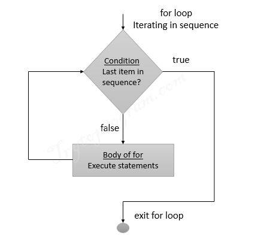
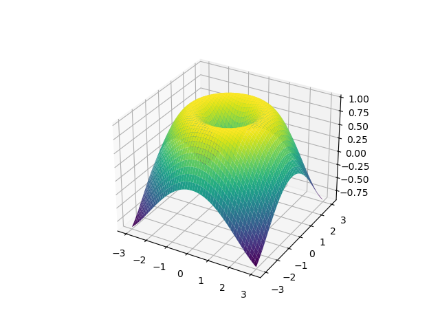

<!-- style: |
  section {
    font-family: "Helvetica", serif;
  }
-->


# Python Beginners Bootcamp
## Universität Potsdam
### Winter 2025

```python
print("Hello world!")
```
<br>

###### Dr. Natalie Williams  
###### natalie.williams@uni-potsdam.de
---
## Logistics
- This course is a one week intensive course designed to teach basic Python programming for data analysis
- The course is aimed at complete beginners to Python or programming in general, those who know another language, or just those that want to brush up 
- Each day will consist of two sessions: one from 10:00 - 13:00, and one from 14:00 - 17:00
- All sessions will take place here in room 0.087

---
## Logistics
- Each session will be lecture style for ~45 mins, followed by hands on coding for the remaining time where I will be available to help
- Material is available on moodle, and you may use the computers here or your own personal laptop
- You are encouraged to work together with your neighbour, and to google things - [stackoverflow](https://stackoverflow.com/questions) is your friend (whilst ChatGPT can write code, you are encouraged not to use it whilst learning)
- This is the first time this course is being delivered, so please ask questions is something is unclear! We can slow things down as much as needed.

---
## Course content

#### What this course will cover
- Basic shell usage
- Python basics: Variables, input/output, operators, data types
- Control flow: conditional statements, boolean logic, error handling
- Data structures: Lists, tuples, dictionaries, sets
- Loops & functions
- Important modules: `matplotlib`, `numpy`, `scipy`, `astropy`
- Conda and virtual environments
---
#### What this course won't cover
- Shell scripting
- Binary and computer memory allocation
- Linux system administration or remote access tools
- More advanced Python: classes, generators, lambda functions
- Graphical user interfaces or animations
- Git

This is a course in Python *for scientists* **not** computer programmers, so we will focus on the practical aspects of Python and not the nitty grtty details.

---
## What is Python?
- Python is a high level, interpreted programming language
- As an interpreted language it is easy to run and does not require a separate compiler such as with C/C++
- It is known for its ease of use and clear syntax
- Python is widely used in the scientific community, particularly for data analysis
- Python lets you use packages and code written by others easily, so you can build powerful programs without starting from scratch
---
### 
### Pros of Python
- Easy to read and write, very intuitive and easily debugged
- Huge community and libraries available
- Versatile, used in many industries
### Cons of Python 
- Slower than compiled languages such as C/C++
- Can be inefficient with memory
- Dynamically changing libraries can lead to outdated code
---
# Session 1: Using the Terminal
```bash
Natalie@mylinux:~$ pwd
/home/williams

Natalie@mylinux:~$ ls
mycode.py  Documents    

Natalie@mylinux:~$ mkdir Computing

Natalie@mylinux:~$ cd Computing

Natalie@mylinux:~/Computing$ touch mynotes.txt
```
---
## The terminal
- Before we look at Python, we need to understand how to navigate our computer system using the **terminal**
- The terminal is a text based interface which allows us to interact with the computer
- This may seem unnecessary when we have a file explorer - however using the terminal provides much more flexibility, and as you become proficient at coding it will become easier and necessary to use the terminal
---
## Opening the terminal
Linux & macOS:
Search in applications for "Terminal"

Windows:
Search in applications for "Powershell" or "Windows Terminal"
Download WSL (once) with 
```bash
wsl --install
```
Open WSL from Powershell or Windows Terminal with
```bash
wsl
```
---
## Where am I?
- When opening the terminal, we see the **command line**
- In the command line it shows `user_name@computer_name:location$`
```bash
Natalie@mylinux:~$
```
- We are in a location, our home **directory** (folder), denoted by `~`.
- To check where you currently are in the file system, you can use the command  `pwd` to print our current location (or **path**)

```bash
Natalie@mylinux:~$ pwd
/home/Natalie
```

---

## The file system


---
## Commands
- We will explore some of the most useful **commands** that can be used on the command line and their functionality
- Each command may have many options, these can be listed for most commands by using `man *command*` or `*command* --help`

```bash
Natalie@mylinux:~$ pwd --help
```
```bash
Natalie@mylinux:~$ man pwd
```
- **Top tip**: Use the up and down arrowkeys to cycle through previous commands rather than typing them out again
---

## Looking around
<style>
.term-dir { color: blue; }
.term-exe { color: green; }
.term-zip { color: red; }
.term-symlink { color: orange; }
.term-hidden { color: gray; }
</style>

- The contents of the location we are in can be viewed with `ls`

```bash
Natalie@mylinux:~$ ls
Documents   mycode.py  
```
- These file types are colour-coded as normal files, <span class="term-dir">documents</span>, and <span class="term-exe">executable files</span>.
- Hidden files (files/directories that start with `.` and are hidden from the user) can be shown with `ls -a`

```bash
Natalie@mylinux:~$ ls -a
.  ..  .bashrc mycode.py  Documents  .jupyter  .ssh
```

---

## Looking around

- To view more details on the files we use `ls -l` with form 
```
permissions | # of hard links | Owner | Group | File size (bytes)| Last modified | Name
```
```bash
Natalie@mylinux:~$ ls -l
drwxr-xr-x  6 Natalie Natalie    4096 Feb 20 14:32  Documents
-rw-rw-r--  1 Natalie Natalie       5 Mar 27 14:34  mycode.py
```
- Permissions are laid out as d<span class="term-dir">rwx</span><span class="term-exe">rwx</span><span class="term-zip">rwx</span> where d - directory, r - read, w - write, x - execute for <span class="term-dir">user</span>, <span class="term-exe">group</span> and <span class="term-zip">others</span> users
- Permissions can be changed with `chmod` i.e., `chmod u+x mycode.py`
---
## Moving around
- To move to another directory from your current location use `cd`

```bash
Natalie@mylinux:~$ cd Documents
Natalie@mylinux:~/Documents$ ls
Computing    myfile1.txt    myfile2.txt
```
- **Top tip**: use tab to autocomplete file and directory names
- We denote one directory back with `..`, and the current with `.` 
```bash
Natalie@mylinux:~/Documents$ cd ..
Natalie@mylinux:~$ cd .
Natalie@mylinux:~$
```

---

## Moving around
- When only running `cd`, it takes you back to your home directory, this is the equivalent of `cd ~`
- We can pass **relative paths** from the current position

```bash
Natalie@mylinux:~$ cd Documents/Computing
Natalie@mylinux:~/Documents/Computing$ cd ../Computing
```
- We can also pass **absolute paths** to anywhere on system
```bash
Natalie@mylinux:~$ cd /home/Natalie/Documents/Computing
Natalie@mylinux:~/Documents/Computing$ cd ~/Documents
Natalie@mylinux:~/Documents$ cd /usr/bin
```
---
## Creating and deleting directories
- We make new directories using `mkdir` 
```bash
Natalie@mylinux:~$ mkdir Masters
Natalie@mylinux:~$ ls
Documents   Masters   mycode.py  
Natalie@mylinux:~$ cd Masters
Natalie@mylinux/Masters:~$
```
- Directories can be deleted with `rm -r` (only need `rm`  for files)
```bash
Natalie@mylinux:~$ rm -r Masters
Natalie@mylinux:~$ ls
Documents   mycode.py
```
---
## Copying and moving files/directories
- We can copy a file/directory using `cp` 
```bash
Natalie@mylinux:~$ cp mycode.py ./Documents
Natalie@mylinux:~$ ls ./Documents
Computing    mycode.py    myfile1.txt    myfile2.txt 
Natalie@mylinux:~$ cp mycode.py mycode_copy.py
Natalie@mylinux:~$ ls
Documents   mycode.py   mycode_copy.py 
```
- We can move/rename a file/directory with `mv`
```bash
Natalie@mylinux:~$ mv mycode.py ./Documents/Computing
Natalie@mylinux:~$ mv mycode_copy.py mycode_renamed.py
```

---
## Creating files and text editing
- We can create a new file with `touch`
```bash
Natalie@mylinux:~$ touch newfile.txt
Natalie@mylinux:~$ ls
Documents   mycode.py   newfile.txt
```
- We can also create a file using a text editor (emacs, nano, vim)
```bash
Natalie@mylinux:~$ vim newfile.txt
Natalie@mylinux:~$ emacs newfile.txt &
```
Here `vim` opens in the terminal, `emacs` in the background (with `&` )

---
## Using `vim`
- We use `vim` as an example - after opening the file press `i` to start editing
```bash
This is my text file


--INSERT--                                                   1,1         All
```
- After finishing press `esc` and enter `:wq` to write and quit, or `:q!` to quit without saving and go back to the terminal
- Vim can be used to write Python files with, i.e. `vim myscript.py`

---

# Session 2: Python basics
```python
# Calculate adjusted travel time to the ISS

name = input("Astronaut name: ")
speed = int(input("Speed in km/s: "))
distance = 400
time = distance / speed

time += 2  # docking delay
print(f"ETA for {name[:3]}: {time}")

```
---
## Installing python
Everything for this course is set up on the lab computers, however you can do the exercises on your personal laptops if you wish.

You will need to make sure Python is installed - you can download Python [here](https://www.python.org/downloads/).

All exercises will be done through jupyter notebooks - for now this is easiest done by downloading and launching [Anaconda navigator](https://www.anaconda.com/products/navigator).

---
## How does Python run code?
- Python execute your code **one line at a time**, from top to bottom
- This means
```python
This line runs first
Then this one
And so on...
```
- If there's an error on a line, Python **stops running**, and shows an error, reading no more code
- This makes it easy for us to debug code

---
## Ways to run Python
- On the terminal line by line
```bash
Natalie@mylinux:~$ python
>>> print('Hello world')
Hello world
```
- Through a prewritten python script (`.py` file) via the terminal
```bash
Natalie@mylinux:~$ python myscript.py
```
- Through an interactive development environment (Spyder, PyCharm, Visual Studio Code, Jupyter notebooks/lab)
---

## Print
- The `print()` function displays output to the screen
- You can print text, numbers or variables
- Use quotes `""` or `''` for text (strings)
```python
print('Hello world!') 
```
Output: 

```bash
Hello world!
```

---

## Comments
- Comments allow us to add text to our code which is **not read** by the code
- This allows us to explain what the code is doing, which is very useful for long and complex code
- You are **highly encouraged** to comment your code - both for yourself looking back at code and anyone marking your code to understand what you did
- Comments are added by inserting a `#` followed by the comment
```python
print('Hello world!') # This line outputs 'Hello world!'
```

---
## Variables
- Variables are names chosen by the coder to store values
- We **assign** values to variables with `=`
- Variable names can include letters, numbers and underscores, but **cannot** start with a number or contain spaces
- Variables can be overwritten (be careful!)
- Multiple variables can be assigned at once
```python
x = 5
y, z = x, 0.3
x = 2
print(x, y, z) # This will print: 2 5 0.3
```
---
## Data Types
- There are several distinct data types we use in Python, including  `int` (integers), `float` (decimals), `string` (text), `bool` (true/false)
- We can check the data type of a variable with `type()`

```python
x = 5 # int -> integer
factor = 2.4 # float -> decimal
greeting = 'hello' # string -> text
mybool = True

y = 2. # this is a float = 2.0
a = 1.5e-3 # this is a float = 0.0015
print(type(greeting)) # Output -> <class 'string'>
```
---
## Casting
- We can specify the data type we would like, and where allowed, convert between them
```python
x, y, z = int(3), int(2.8), int('5') # x is 3, y is 2, z is 5  

x, y, z = float(3), float(2.8), float('5') # x is 3.0, y is 2.8, z is 5.0

x, y, z = str('hello'), str(3), str(2.8) # x is 'hello', y is '3', z is '3.8'

x = 4.7
y = int(x) # y is 4
z = 'hello'
int(z) # raises ValueError -> letters cannot be converted to numbers
```
---
## Operations
- Python is built in with simple operations
- These include add `+`, minus `-`, times `*`, divide `/`, power `**`, modulus (remainder)`%` and floor division `//`

```python
x = 5
y = (6 - x)**2 / x # y is 0.2
z = y + x # z = 5.2
```

Note that during operations data types may be implicitly converted i.e. `x` is implicitly converted from `int` to `float` in this last line

---

## Assignment operators
- In this previous slide the variables are never altered (`x` stays 5, `y` stays 0.2 etc)
- Variables can be altered, this is commonly done with assignment operators which take the form `*operator*=`

```python
x = 5
x +=3 # equivalent to x = x + 3, x is now 8
x *=2 # equivalent to x = x * 2, x is now 16
x //= 3 # equivalent to x = x // 3, x is now 5
```
---

## Conditional Operators
- Conditional operators are used to compare values
- They return a **boolean** (data type `bool`) value `True` or `False`, which if treated as integers are equal to 1 and 0 respectively
- Examples include equal `==`, not equal `!=`, greater than `>`, less than `<`, greater or equal to `>=`, less than or equal to `<=`
```python
x, y = 5, 5.0
x == y # True -> implicitly converts x to a float to compare
x <= 10 # True
greeting, another_greeting  = 'hello', 'hello '
greeting == another_greeting # False - how are they not the same?
a = x != greeting # a = True, we are allowed to compare different data types
```

---
## Logical Operators
- Logical operators combine conditional operators
- These are `and` (returns `True` if both statements are true), `or` (returns `True` if one statement is true) and `not` (reverses the result, returns `False` if `True` and vice versa)

```python
x, y = 2, 7
x < 5 and y > 5 # True
x >= 10 or y != 3 # True
not(x >= 10 and y != 3) # False
```

---
## Indexing strings
- We can also use the `+` operator to concatenate strings
```python
name, message = 'Natalie', 'Hello, '
greeting = message + name + '!'
print(greeting) # 'Hello, Natalie!'
```
- We use `stringname[i]` to **index** the i-th component of a string
- **Important**: In Python indexing starts a 0, **not** 1
```python
print(name[0]) # first component -> 'N'
print(name[2]) # third component -> 't'
print(name[-1]) # last component -> 'e'
print(name[-3]) # third last component -> 'l'
```
---

## Slicing strings
- Slicing can be used to index multiple components of a string with notation `stringname[start:stop:step]` with defaults of `start = 0`, `stop = -1` and `step = 1`
```python
name = 'Natalie'
print(name[2:5]) # 3rd to 5th -> 'tal'
print(name[:5]) # 1st to 5th -> 'Natal'
print(name[5:]) # 5th to end -> 'ie'
print(name[1:6:2]) # every 2nd letter 2nd to 7th -> 'aai'
print(name[::3]) # every 3rd letter -> 'Nae'
```
- We can also use `len` to get the length of a string i.e. `len(name`)

---
## Modifying strings
- Here is a selection of useful **methods** used to modify strings
```python
x = ' Hello, World! '

print(x.upper()) # returns string in upper case -> ' HELLO, WORLD! '

print(x.lower()) # returns string in lower case -> ' hello, world! '

print(x.strip()) # removes whitespace -> 'Hello, World!'

print(x.replace('H', 'J')) # replaces one string with another -> ' Jello, World! '

print(x.split(',')) # returns a list of strings split by ',' -> '[' Hello', 'World! ']'

```

---
## Formatting strings
- We can combine strings and numbers easily by using **f-strings**
- This requires `f` to be placed before the string, and number variables placed as `{num}`
```python
num = 42
txt = f'The answer to Life, the Universe and Everything is {num}'
print(txt) # 'The answer to Life, the Universe and Everything is 42'
```
- Specify the number `n` of decimals to display `x` with `x:.nf`
```python
pi = 3.14159265359
print(f'Pi is {pi:.2f}') # 'Pi is 3.14'
```

---
## User input
- We use the function `input` to take an input from the user
```python
name = input('Enter your name')
print(f'Hello {name}')
```
- Input **always** takes the input as a string, so if you require a number this needs to be manually converted
```python
x = input('Enter a number')
print(x + 5) # returns TypeError: can only concatenate str (not "int") to str
x = int(input('Enter a number'))
print(x + 5) # returns expected value
```
---
# Session 3: Lists, Tuples, Sets & Dictionaries

```python
planets = ["Mercury", "Venus", "Earth"]
constellations = ("Orion", "Cassiopeia", "Lyra")
observatories = {"ALMA", "Keck", "VLT", "ALMA"}
galaxy = {"name": "Andromeda", "distance": 2.5}

planets.append("Mars")
print(constellations[1])
print(observatories)
print(galaxy["distance"])
```
---
## Lists 
- Lists are an **ordered**, **mutable** collection (can be changed after it has been created) denoted by square brackets

```python
planets = ["Mercury", "Venus", "Earth"]
series = [2 , 8 , 3 , 4]
```
- Lists can be indexed and sliced to obtain values
```python
print(planets[2]) # 'Earth'
print(series[1:3]) # [8 , 4]
```
---
## Changing and adding to lists 
- Lists can be changed using indexing

```python
planets[1] = 'Mars'
print(planets) # ['Mercury' , 'Mars' , 'Earth']
```
- We add single values to the end with the `append` method, inserted in specific positions with `insert`, and concantenate lists together with `extend` or `+`
```python
planets.append('Jupiter')
planets.insert( 1 ,'Venus')
planets.extend(['Saturn', 'Neptune'])
print(planets) # ['Mercury' , 'Venus' , 'Mars' , 'Earth', 'Jupiter' , 'Saturn' , 'Neptune']
```

---
## Removing from lists 
- Items are removed by value with `remove` (removes first item of this value) and index with  `pop`

```python
planets.remove('Earth')
planets.pop(3)
print(planets) # ['Mercury' , 'Venus',  'Mars' , 'Saturn' , 'Neptune']
```
- Lists are mutable, so methods change them directly; string methods return new strings instead of changing the original.
```python
mystring = 'Hello'
mystring[0] = 'J' # TypeError: 'str' object does not support item assignment
```

---

## Lists properties
- Different data types can be combined in one list, and values can be repeated

```python
mylist = ["banana", 4 , 1.8e-7 , "banana"]
```
- Other useful **functions** (do not change the list) include
```python
x = [2, 6, -3, 8]
print(len(x)) # length of list -> 4
print(sum(x)) # sum if numeric -> 16
print(min(x)) # minimum if numeric -> -3
print(max(x)) # maximum if numeric -> 8
```
---
## Nested Lists
- Lists can contain lists
```python
matrix = [
  [1 , 2 , 3],
  [4 , 5 , 6],
  [7 , 8 , 9]
]
```
- This is a now a multidimensional object, and can be indexed as `matrix[row][column]`
```python
print(matrix[1][2]) # 6 
```
---

## Tuples

- A tuple is a collection which is ordered and **unchangeable**, written with round brackets
```python
planets = ("Mercury" , "Venus" , "Earth")
```
- We cannot change, add or remove items from a tuple
- Multiple entires with the same value are allowed
```python
planets = ("Mercury" , "Venus" , "Earth" , "Venus")
```
---

## Creating tuples
- Tuples can be created with one item but **must** contain a `,`
```python
planets = ("Earth") # NOT a tuple
planets = ("Earth",) # a tuple
```
- Tuples can contain any and multiple data types
```python
mytuple = ("Earth" , 5 , True , 3.46e5)
```
- `len` can still be used to obatain a tuple length
```python
print(len(mytuple)) # 4
```
---

## Accessing tuples
- Values in tuples can still be indexed and sliced
```python
planets = ("Mercury" , "Venus" , "Earth" , "Mars")
print(planets[2]) # "Earth"
print(planets[1:-1]) # ("Venus" , "Earth")
```
- You can add a tuple to a tuple with `+`
```python
x = ("Jupiter",)
planets += x
print(planets) # ("Mercury" , "Venus" , "Earth" , "Mars" , "Jupiter")
```
---

## Unpacking tuples
Tuples can be **unpacked** to extract the individual values back into variables
```python
planets = ("Mercury" , "Venus" , "Earth")
(planet1 , planet2 , planet3) = planets
print(planet1) # "Mercury"
```
- Multiple variables can be unpacked with `*`
```python
(planet1 , *other_planets) = planets
print(other_planets) # ("Venus" , "Earth")
```
---
 ## Sets
 - A set is an **unordered, unindexed** collection denoted with curly brackets `{}`
 ```python
planets = {"Mercury" , "Venus" , "Earth"}
print(planets) # {'Mercury', 'Earth', 'Venus'}
```
- Sets can contain all data types, but other collections, sets **do not** allow multiple entries with the same value
 ```python
myset = {"Mercury" , "Venus" , "Earth" , "Mercury", 7.3 , 1 , True, False}
print(myset) # {False, 1, 'Earth', 'Mercury', 7.3, 'Venus'}
```
---
 ## Acessing sets
 - As they are unordered, sets cannot be indexed and can only be accessed by a loop (next session)
 - We can use `in`/`not in` to check if an entry is in/not in a set
 ```python
planets = {"Mercury" , "Venus" , "Earth"}
print("Earth" in planets) # True
print("Venus" not in planets) # False
```
- This also means sets cannot be nested
---
 ## Adding and removing from sets
- Set elements cannot be changed but sets can be added to with the `add` method 
 ```python
planets = {"Mercury" , "Venus" , "Earth"}
planets.add("Mars")
print(planets) # {"Mars" , "Mercury" , "Earth" , "Venus"}
```
- Items can be removed with either the `remove` or `discard` method
 ```python
planets.remove("Venus")
planets.discard("Mars")
print(planets) # {"Mercury" , "Venus"}
```
---
 ## Joining sets
- There are various method to join sets
 ```python
planets1 = {"Mercury" , "Venus" , "Earth"}
planets2 = {"Venus" , "Earth" , "Mars"}

print(planets1.union(planets2)) 
# joins items from both sets ->  {'Earth', 'Venus', 'Mercury', 'Mars'}
print(planets1.intersection(planets2)) 
# joins but keeps only duplicates -> {'Earth', 'Venus'}
print(planets1.difference(planets2)) 
# keeps itens in first set not in the second ->  {'Mercury'}
print(planets1.symmetric_difference(planets2)) 
# keeps all except duplicates -> {'Mercury', 'Mars'}
```
---
## Dictionaries

- Dictionaries are **ordered, changeable** collections
- Denoted with curly brackets with key: value pairs `{key:value}`
```python
Mars = {
  "Radius": 3389.5,
  "Colour": "Red",
  "Temperature": -65 }
print(Mars) # {'Radius': 3389.5, 'Colour': 'Red', 'Temperature': -65}
```
- Since they are unordered, dictionaries cannot be indexed
```python
print(Mars[0]) # KeyError: 0
```
---
## Dictionaries
- Duplicate entries will overwrite existing values
```python
Mars = {
  "Radius": 3389.5,
  "Colour": "Red",
  "Temperature": -65, 
  "Colour": "Blue" }
print(Mars) # {'Radius': 3389.5, 'Colour': 'Blue', 'Temperature': -65}
```
- Dictionary keys can also be numbers

```python
mydict = {0: 1}
print(mydict)  # {0: 1}
```
---
## Accessing dictionaries
- Items are accessed with `dict_name["key_name"]`
```python
Mars = {
  "Radius": 3389.5,
  "Colour": "Red",
  "Temperature": -65 }
print(Mars["Colour"]) # 'Red'
```
- Key names can be listed with `keys`, and values with `values`
```python
print(Mars.keys()) # dict_keys(['Radius', 'Colour', 'Temperature'])
print(Mars.values()) # dict_values([3389.5, 'Red', -65])
```
---
## Editing dictionaries
- Dictionaries can be added and changed with an assigment
```python
Mars["Period"] = 687
Mars["Colour"] = "Blue"
print(Mars) # {'Radius': 3389.5, 'Colour': 'Blue' , 'Temperature': -65, 'Period': 687}
```
- Entries can be deleted with the `pop` method
```python
Mars.pop("Period")
print(Mars) # {'Radius': 3389.5, 'Colour': 'Blue' , 'Temperature': -65}
```
---
## Editing dictionaries
- Dictionaries can be copied with the `copy` method
```python
Mars_2 = Mars.copy()
```
- You **cannot** copy dictionaries through assignement ie ` Mars_2 = Mars` as any changes to one will change the other

---
## Nested dictionaries
- Dictionaries can be **nested** 
```python
planets = {
  "Mercury" : {
    "Radius" : 2439,
    "Mass" : 3.285e23 },
  "Venus" : {
    "Radius" : 6052,
    "Mass" : 4.867e24 },
  "Earth" : {
    "Radius" : 6378,
    "Mass" : 5.972e24
  }
}
```

---
## Nested dictionaries
- To access the items in a nested dictionary, use the key names moving outside in
```python
print(planets["Venus"]["Radius"]) # 6052
```
- Again we can use `len` to get the length of a dictionary
```python
print(len(Mars)) # 3
```
---

<table border="0" cellpadding="0" cellspacing="0" style="border-collapse: collapse; text-align: left; font-size: 14px;">
  <thead style="background-color: #f2f2f2;">
    <tr>
      <th>Property</th>
      <th>List</th>
      <th>Tuple</th>
      <th>Set</th>
      <th>Dictionary</th>
    </tr>
  </thead>
  <tbody>
    <tr>
      <td><strong>Syntax</strong></td>
      <td>[1, 2, 3]</td>
      <td>(1, 2, 3)</td>
      <td>{1, 2, 3}</td>
      <td>{"a": 1, "b": 2}</td>
    </tr>
    <tr>
      <td><strong>Ordered</strong></td>
      <td>Yes</td>
      <td>Yes</td>
      <td>No</td>
      <td>Yes (Python 3.7+)</td>
    </tr>
    <tr>
      <td><strong>Indexed</strong></td>
      <td>Yes</td>
      <td>Yes</td>
      <td>No</td>
      <td>By key</td>
    </tr>
    <tr>
      <td><strong>Mutable</strong></td>
      <td>Yes</td>
      <td>No</td>
      <td>Yes</td>
      <td>Yes</td>
    </tr>
    <tr>
      <td><strong>Allows Duplicates</strong></td>
      <td>Yes</td>
      <td>Yes</td>
      <td>No</td>
      <td>Keys: No<br>Values: Yes</td>
    </tr>
  </tbody>
</table>


---

# Session 4: Control Flow & Error Handling  
```python
numbers = [10, -5, 0, 23, -1]

for n in numbers:
    if n > 0:
        print(f"{n} is positive")
    elif n < 0:
        print(f"{n} is negative")
    else:
        print("Zero found")
```
---
## `if`, `elif` and `else`

- We can combine the conditional statements we saw in session 2 (i.e. `==`, `<`, `>`)with `if`, `elif` and `else` statements to selectively evaluate blocks of code such as
```python
if *some condition evaluates true *:
  *do something*
elif *some other condition evaluates true*:
  *do a different thing*
else:
  *do yet another different thing* 
```
---
## `if`, `elif` and `else`
- If a statement evaluates to `True`, the indented code block is ran, and skipped otherwise
```python
print(5 > 0) # True
print(5 == 6) # False

if 5 == 6:
  print('This is True') # This would not run as 5 == 6 is False
elif 5 > 3:
  print('This is True') # This would run as 5 > 3 is True 
elif 5 == 5:
  print('This is True') # This would not run as the clause above was already fulfilled
else:
  print('Neither of these were True') # This would not run as one of the above was True
```
---
## Aside: a note on indentation
- Notice that after the `if`/`elif`/`else` statements there is an indent - this is not style but **necessary**
```python
x = 5
if x > 0:
  print('checking...') # this will run fine
  print('positive number') # both these lines are in the same code block and will run together
print('moving on...') # this will run regardless - outside of the if code block

if x > 0:
print('positive number') # This will raise an IndentationError
```
- We call the indented section a **code block** as it is a group of lines that are run together
---
## `if`, `elif` and `else`
- In a series of `if`, `elif` and `else` statements, if one is `True `, the rest are skipped
```python
number = 8
if number > 5:
  print("Number is greater than 5")
elif number % 2 == 0:
  print("Number is even")
elif number > 10:
  print("Number is greater than 10")
else:
  print("Number is 5 or less and odd")
# prints only the first one -> Number is greater than 5
```
---
## `if`, `elif` and `else`
- Alternatively a series of only `if` statements, they are run separately
```python
number = 8
if number > 5:
  print("Number is greater than 5")
if number % 2 == 0:
  print("Number is even")
if number > 10:
  print("Number is greater than 10")
# prints each one it fulfills -> Number is greater than 5    Number is even
```
---
## `if`, `elif` and `else`
- We can use logical operators as well as conditional operators in  our statements
```python
number = 5
if number % 2 == 0 and number > 10: # runs if both conditions evaluate to True
  print(f"{number} is even and greater than 10") # this does not run
elif number % 2 != 0 or number == 10: # runs if at least one condition evaluates to True
  print(f"{number} is either odd or exactly 10") # this runs
elif not number > 0:
  print(f"{number} is negative")  # runs if condition is not True
else: # runs if neither of the above were fulfilled
  print(f"{number} does not match the above conditions") # this does not run
```
---
## `while` loops

- `while` loops repeat a block of code whilst some condition is `True`
```python
i = 1
while i < 10: # runs code block while this is True
  print(f'{i} is less than 10')
  i += 1
```
- Warning: without proper care while loops can run infinitely! (cancel with a) terminal: `Ctrl+C`, b) jupyter: restart kernel)
---
## `break` statements

- We cthean force the loop to end with a `break`  statement
```python
number = 1

while number <= 5:
  print(f"Number is: {number}")
    
  if number == 3:
    print("Stopping the loop early!")
    break  # exit the loop completely immediately
    print("That was a break!") # this will never run!
    
  number += 1 # pay attention to indents
  # this runs outside of the if, but inside the while
```
---
## `break` statements
- We can use break statements to exit an otherwise infinte loop
```python
count = 0

while True: # this forms an infinite loop as it will always be True
  print(f"Loop number: {count}")
  count += 1

  if count == 5:
    print("Reached 5, breaking the loop.")
    break  # Exit the infinite loop
```
---
## `continue` statements

- We can force a loop to skip the rest of it's block and return to the start with `continue`
```python
i = 0 
while i < 10:
  i += 1
  if i == 5:
    print(f'skipping 5!')
    continue
  print(i)
```
---
## Exception handling
- We can check for errors and deal with them before we run a line with `try` and `except`
```python
try:
  num = int("hello")  # trying to convert text to a number
except:
  print("Something went wrong!")
print("anyway...moving on!")
```
- Here if an error takes place in the `try` block, it triggers the `except` block, but the code still continues after
---
## Exception handling
- We can combine this with a `while` loop to ensure the user inputs the correct data type for the problem
```python
while True:
  try: 
    number = int(input("Enter a number: ")) # Errors if string is given
    print(f"You entered: {number}")
    break  # Exit the loop if input is valid
  except: # can also specify except ValueError for example
    print("Invalid input. Please enter a valid number.")
```
---
## `for` loops

- We can loop over a sequence (i.e. list, tuple, dictionary, set, string) with a `for` loop
```python
planets = ['Mercury', 'Venus', 'Mars']
for x in planets: 
  print(x)
```
- We have assigned a variable `x` to take on each value in the list per loop iteration
---
## `range`
- When looping over consecutive numbers it is useful to create a list  to loop over with the `range` function
```python
for i in range(6): # range(6) = [0 , 1 , 2 , 3 , 4 , 5]
  print(i)

for i in range(2, 6): # range(2, 6) = [2 , 3 , 4 , 5]
  print(i)

for i in range(2, 12 , 3): # range(2, 12, 3) = [2 , 5 , 8 , 11]
  print(i)
```
---
## Accessing index and variable
- We can loop over the indexes of a collection by creating a list with `range` up to `len` of the collection
```python
planets = ['Mercury' , 'Venus' , 'Earth' , 'Mars']
for i in range(len(planets)):
  print(f'planet {i}:{planets[i]}')
```
- Alternatively we can use `enumerate` which gives index and value
```python
planets = ['Mercury' , 'Venus' , 'Earth' , 'Mars']
for i, planet_name in enumerate(planets):
  print(f'planet {i}:{planet_name}')
```
---
## `break` and `continue`
- We can also use `break ` and `continue` in `for` loops
```python 
for num in range(-10,10):
  if num < 0:
    continue  # skip negative numbers

  print(f"Checking number: {num}")

  if num == 5:
    print("Found the number 5! Breaking the loop.")
    break
```
---
## Nested `for` loops
- We can work in n dimensions by using n nested `for` loops
```python
for i in range(1, 4):  # Outer loop
  for j in range(1, 4):  # Inner loop
    print(f"{i} x {j} = {i * j}") # loops through every combination of i and j
```
- This is particularly useful when indexing multidimensional objects
```python
matrix = [[1, 2, 3],[4, 5, 6],[7, 8, 9]]

for i in range(len(matrix)):
  for j in range(len(matrix[i])):
    print(f"Value at ({i}, {j}) is {matrix[i][j]}")
```
---
## Debugging code
- Coding can be very frustrating, and many times it isn't clear why the code doesnt work (or sometimes why it does...)
- The code may give a confusin or misleading error message, or it might run but give nonsensical answers (`nan`, `inf`)
```python
def calculate_average_temperature(temps):
    total = 0
    count = 0
    for temp in temps:
        total += temp
    return total / count
temps = [5778, 9940, 3500]
print("Average temp:", calculate_average_temperature(temps)) # ZeroDivisionError
```
---
## Debugging code
- Print statements are your friend - use them plentifully and throughout to track where the error comes in
```python
def calculate_average_temperature(temps):
    total = 0
    count = 0
    for i, temp in enumerate(temps):
        print(f"Index {i}: temp = {temp}, total before adding = {total}, count before adding = {count}")
        total += temp
        print(f"Total after adding: {total}")
    print(f"Final total: {total}, final count: {count}")
    return total / count 

temps = [5778, 9940, 3500]
print("Average temp:", calculate_average_temperature(temps))
```
---
## Debugging code
- Print statements are your friend - use them plentifully and throughout to track where the error comes in
```python
Index 0: temp = 5778, total before adding = 0, count before adding = 0
Total after adding: 5778
Index 1: temp = 9940, total before adding = 5778, count before adding = 0
Total after adding: 15718
Index 2: temp = 3500, total before adding = 15718, count before adding = 0
Total after adding: 19218
Final total: 19218, final count: 0
Traceback (most recent call last):
  ...
ZeroDivisionError: division by zero
```
---
# Session 5: Functions

```python
def luminosity(radius, temperature):
    """
    Calculate the luminosity of a star using the Stefan-Boltzmann law.
    Parameters:
        radius (float): Radius of the star in meters (m).
        temperature (float): Surface temperature of the star in Kelvin (K).
    Returns:
        float: Luminosity in watts (W).
    """
    sigma = 5.670374e-8  # Stefan-Boltzmann constant in W/m²·K⁴
    return 4 * 3.1416 * radius**2 * sigma * temperature**4

L = luminosity(6.96e8, 5778)
print(f"Luminosity: {luminosity(6.96e8, 5778):.2e} W")
```
---
## Creating functions
- Functions are like a mini-program inside your code
- Functions take input arguments and return output arguments
- They can be used to reuse code without copy/pasting chunks
- Functions must be defined with `def`, the contents must be indented, and values may (not must) be returned with `return`
```python
def greet(name): # def function_name(parameter1, parameter2)
    return f"Hello, {name}!" # return output_parameters

print(greet("Natalie")) # Output: Hello, Natalie!
print(greet("Nobody")) # Output: Hello, Nobody!
```
---
## Function inputs
- Functions can take a number of arguments of varying data types
```python
def describe_planet(name, moons, mass):
    return f"{name} has {moons} moon(s) and a mass of {mass:.2e} kg."

print(describe_planet("Mars", 2, 6.39e23)) 
# Mars has 2 moon(s) and a mass of 6.39e+23 kg.
```
- When passing arguments to functions in this way, they must be in the correct order, these are called **positional arguments**
```python
print(describe_planet(2, "Mars", 6.39e23)) 
# 2 has Mars moon(s) and a mass of 6.39e+23 kg.
```
---
## Default Arguments
- We can assign default values to a function that can be overwritten
```python
def describe_star(name="Sun", temperature=5778):
    return f"{name} has a surface temperature of {temperature} K."

# Example usages
print(describe_star())                      # Uses both default values
# Sun has a surface temperature of 5778 K.

print(describe_star("Sirius"))              # Overrides name, uses default temperature
# Sirius has a surface temperature of 5778 K.

print(describe_star("Betelgeuse", 3500))    # Overrides both
# Betelgeuse has a surface temperature of 3500 K.
```
---
## Positional arguments and `*args`
- We can pass an unspecified number of positional arguments using `*`
```python
def third_planet(*planets):
    print("The third planet is " + planets[2])

third_planet("Mercury", "Venus", "Earth", "Mars") 
# The third planet is Earth
```
---
## Keyword arguments and `**kwargs`
- **Keyword arguments**, unlike positional arguments, can be passed in any order
```python
def describe_planet(name, moons, mass):
    return f"{name} has {moons} moon(s) and a mass of {mass:.2e} kg."

print(describe_planet(mass = 6.39e23, moons = 2, name = "Mars")) 
# Mars has 2 moon(s) and a mass of 6.39e+23 kg.
```
---
## Keyword arguments and `**kwargs`
- We can use `**kwargs` to pass an unspecified number of keyword arguments
```python
def info(*args, **kwargs):
    print("Positional args:", args)
    print("Keyword args:", kwargs)

info("Mercury", "Venus", name="Earth", moons=1)
# Positional args: ('Mercury', 'Venus')
# Keyword args: {'name': 'Earth', 'moons': 1}
```
---
## Docstrings
- Docstrings are a special kind of string placed right after the `def` line, which describes what a function does, its inputs and outputs
```python
def greet(name):
    """
    Say hello to a person.
    Parameters:
        name (str): The person's name.
    Returns:
        str: A greeting message.
    """
    return f"Hello, {name}!"
```
---
## Docstrings
- Where comments are there for the developer, doctrings are there for the user to make it clear the usage of a function. The docstring can be accessed with `help(function_name)` (anywhere) or `function_name?` (ipython/jupyter)
```python
Signature: greet(name)
Docstring:
Say hello to a person.
Parameters:
    name (str): The person's name.
Returns:
    str: A greeting message.
Type:      function
```
---
## Global and local variables
- **Global** variables are set outside functions and used anywhere.
- Within a function, variables can be defined - however these are **local** variables, and cannot be accessed outside the function
```python
planet = "Earth"  # Global variable

def describe():
    moon = "Moon"  # Local variable
    print(f"{planet} has a natural satellite called {moon}.")

describe() # Earth has a natural satellite called Moon.
print(planet)  # "Earth"
print(moon)    # NameError: name 'moon' is not defined
```
---
## Global and local variables
- We can force a variable inside a function to be a global variable with `global`
```python
planet = "Earth"  # Global variable

def rename_planet():
    global planet
    planet = "Mars"  # Modify the global variable
    print("Planet renamed inside function.")

rename_planet()
print("Planet is now:", planet)
```
- Using `global` is discouraged, it makes code hard to follow/debug
---
## Loops within functions
- Loops can be used freely within functions
```python
def total_luminosity(luminosities):
    total = 0
    for L in luminosities:
        total += L
    return total

stars = [3.5e26, 1.2e27, 5.8e25]  # Luminosities in watts
print(f"Total luminosity: {total_luminosity(stars):.2e} W")
# Total luminosity: 1.57e+27 W
```
---
## Nested functions
- It is also possible to define a function within a function
```python
def star_report(stars):
    print("Report start")

    def level(L):
        if L > 1e26: 
          return "bright"
        else:
          return "dim"
    for star in stars:
        print(f"{star}: {level(stars[star])}")
stars = {"Sirius":2.5e27, "Alpha Cen":1.5e26, "Barnard":3e25}
star_report(stars) # Sirius: bright, Alpha Cen: bright, Barnard: dim
```
---
## Classes
- Classes are a way to group data and their related functions (**methods**) into a single **object**
- We will not cover classes in detail - scientific tasks can be done using functions and libraries
- **However** if you ever want to write your own library of code, most likely you would do so in a class
- Though we won't write classes often, we use them all the time
- Dictionaries, lists, tuples and sets are all examples of classes
---
## Classes
- Classes are initialised using `__init__`, and after initialisation methods (class functions) within a class can be ran
- Classes are always initialised with `self`, which is a reference to the current object inside a class
```python
class Star: # defining a class called 'Star'
    def __init__(self, name, temperature): # initialised with a name and temperature
        self.name = name # assigning the name to the object itself
        self.temperature = temperature # assigning the temperature to the object itself
    def report(self): # defining a method of the class
        return f"{self.name} has a temperature of {self.temperature} K."

sirius = Star("Sirius", 9940) # initialising the class
print(sirius.report()) #running a class method
```
---
## Classes
- In fact, many built-in types you've used — like lists and dictionaries — are already classes in Python
```python
print(type([1, 2, 3]))      # <class 'list'>
print(type((1, 2, 3)))      # <class 'tuple'>
print(type({1, 2, 3}))      # <class 'set'>
print(type({"planet": "Mars", "moons": 2})) # <class 'dict'>

my_dict = {"planet": "Mars", "moons": 2}

# examples of dict methods
print(my_dict.keys())     
print(my_dict.pop("moons"))
```
---
# Session 6: Conda and Packages
```bash
Natalie@mylinux:~$ conda create -n myenv --python=3.13.0

Natalie@mylinux:~$ conda activate myenv

Natalie@mylinux:~$ conda install numpy

Natalie@mylinux:~$ conda install scipy==1.16.0

Natalie@mylinux:~$ conda update scipy

Natalie@mylinux:~$ conda env export > environment.yml

Natalie@mylinux:~$ conda deactivate
```
---
## Packages
- Packages are pre-written codes we can utilise so we don't write everything from scratch
- Packages are installed on the command line with e.g. pip or conda
```bash
pip install numpy
```
```bash
conda install numpy
```
- We will use conda as it has the advantage of managing virtual environments which can be downloaded [here](https://www.anaconda.com/docs/getting-started/miniconda/install#linux)
---
## Virtual environments and `conda`
- Packages are installed by default in the global environment - this can be problematic as different package versions can conflict with one another
- This can lead to broken **dependencies** (the packages that packages require to run) when updating libraries, and code that is not easily reproduced
- Instead virtual environments create a separate workspace for a Python project, with it's own Python version and it's own installed packages
- It can be thought of as a mini-computer for it's own job
---
## Virtual environments and `conda`
##### We use virtual environments because
- We can isolate environments and keep packages between projects separate so they don't interfere with one another
- We can install exact versions of packages without affecting the system Python or other projects
- We can easily share environments so that other users can run your code with the same setup
- It is highly recommended to create a new environment for each coding project you create
---
## Creating `conda` environments
- `conda` environments are created using the `create` command
```bash
(base) Natalie@mylinux:~$  conda create -n "myenv" python=3.12
```
- The environment is created in `~/miniconda3/envs/` or `~/anaconda3/envs/`, the paths are listed with
```bash
(base) Natalie@mylinux:~$  conda env list
```
---
## Cloning and deleting `conda` environments
- Environments can be copied with the `--clone` flag
```bash
(base) Natalie@mylinux:~$  conda create --clone myenv -n myenv2
```
- Environments can be deleted with the `remove` command
```bash
(base) Natalie@mylinux:~$  conda env remove -n myenv2
```
---
## Activating and deactivating environments
- To install packages in the environments or use it for a python script, it must first be activated
```bash
(base) Natalie@mylinux:~$  conda activate myenv
(myenv) Natalie@mylinux:~$
```
- Notice how `base` is now the name of our environment
- The environment can be deactivated with
```bash
(myenv) Natalie@mylinux:~$  conda deactivate
(base) Natalie@mylinux:~$
```
---
## Installing packages
- Packages are installed with `install`, and updated with `update`
```bash
(myenv) Natalie@mylinux:~$  conda install numpy
(myenv) Natalie@mylinux:~$  conda update scipy
```
- If a package is unavailable in conda, it may be available with `pip`
```bash
(myenv) Natalie@mylinux:~$  pip install fastapi
```
- A list of the packages with their versions can be printed with `list`
```bash
(myenv) Natalie@mylinux:~$  conda list
```
---
## Specifying package versions
<table border="0" cellpadding="0" cellspacing="0" style="border-collapse: collapse; text-align: left; font-size: 8px;">
  <thead style="background-color: #f2f2f2;">
    <tr>
      <th>Constraint type</th>
      <th>Specification</th>
      <th>Result</th>
    </tr>
  </thead>
  <tbody>
    <tr>
      <td><strong>Fuzzy</strong></td>
      <td>numpy=1.11</td>
      <td>1.11.0, 1.11.1, 1.11.2, 1.11.18 etc.</td>
    </tr>
    <tr>
      <td><strong>Exact</strong></td>
      <td>numpy==1.11</td>
      <td>1.11.0</td>
    </tr>
    <tr>
      <td><strong>Greater than or equal to</strong></td>
      <td>numpy&gt;=1.11</td>
      <td>1.11.0 or higher</td>
    </tr>
    <tr>
      <td><strong>OR</strong></td>
      <td>numpy=1.11.1|1.11.3</td>
      <td>1.11.1, 1.11.3</td>
    </tr>
    <tr>
      <td><strong>AND</strong></td>
      <td>numpy&gt;=1.8,&lt;2</td>
      <td>1.8, 1.9, not 2.0</td>
    </tr>
  </tbody>
</table>

---
## Exporting environments
- Environments can be exported to a `.yaml` file with
```bash
(base) Natalie@mylinux:~$  conda env export > environment.yml
``` 
- This can then be used to create a copy of the environment
```bash
(base) Natalie@mylinux:~$  conda env create -f myenv.yaml
```
- This is useful to share with others who can create a copy of your environment and run your code with the same dependancies
---
## Virtual environments as `jupyter` kernels
- It's useful to be able to use our environment in a `jupyter-lab` session, which is done with the `ipykernel` package
```bash
(myenv) Natalie@mylinux:~$ conda install ipykernel
```
- The environment can then be added with
```bash
(myenv) Natalie@mylinux:~$ python -m ipykernel install --user --name myenv --display-name "Python (myenv)"
```
- When `jupyter` is relaunched, the kernel for your environment should be available
---
# Session 7: `numpy`
```python
import numpy as np

data = np.loadtxt("luminosities.txt")
night1 = data[:, 1]
night2 = data[:, 2]
change = night2 - night1

mean_change = np.mean(change)
brightest = np.argmax(night2)
total_lum = np.sum(night2)

print(f"Mean change: {mean_change:.2e} W")
print(f"Brightest star ID: {int(data[brightest, 0])}")
print(f"Total luminosity (Night 2): {total_lum:.2e} W")
```
---
## Importing packages
- Packages must be imported at the start of your python script to be used
```python
import numpy

numpy.mean([3 , 7 , 3])
```
- For ease of use, packages can be imported with a shorter name
```python
import numpy as np

np.mean([3 , 7 , 3])
```
---
## Importing packages
- To save space you can import one function from a package
```python
from numpy import mean

mean([3 , 7 , 3])
```
- All functions from a library can be imported with `*` (not recommended - may overwrite functions - debugging headache)
```python
from numpy import *

mean([3 , 7 , 3])
```
---
## Importing packages
- Packages are just folders of code, if you want a function from deep within a subfolder, folders are seperated with `.`
```python
import numpy as np

matrix = [[1, 2], [3, 4]]
print(np.linalg.det(matrix))
```
```python
from numpy.linalg import det as matrix_determinant

matrix = [[1, 2], [3, 4]]
print(matrix_determinant(matrix))
```
---
## What is `numpy`?
- `numpy` (numerical Python) is a library used for working with **arrays**, and has many functions for linear algebra, fourier transforms and matrix operations
- `numpy` is widely used for data handling in Python, and is up to 50x faster than using lists for numerical problems (mostly C/C++ under the hood)
- `numpy` is open source, and new versions are released frequently
- [Documentation](https://numpy.org/devdocs/user/) of `numpy` is clear and useful
---
## Arrays
- `numpy` works with arrays, which are multi-dimensional objects
```python
a0 = np.array(42)                         # 0D scalar
a1 = np.array([1, 2, 3])                  # 1D vector
a2 = np.array([[1, 2, 3], [4, 5, 6]])    # 2D matrix
a3 = np.array([[[1,2,3],[4,5,6]], [[7,8,9],[10,11,12]]])  # 3D tensor
```
- The dimensions of an array can be shown with `shape`
```python
print(a0.shape, a1.shape, a2.shape, a3.shape)
# Output: () (3,) (2, 3) (2, 2, 3)
```
---
## Creating arrays
- We can create arrays either manually as shown before, or with a variety of functions
```python
zeros = np.zeros((3, 4)) # array of zeros (size 3x4)

ones = np.ones((2, 5)) # array of ones (size 2x5)

empty = np.empty((2, 3)) # empty array (uninitialized values, size 2x3)

full = np.full((3, 3), 7) # array filled with a specific value (e.g., 7), size 3x3

range_array = np.arange(10) # array with a range of values (0 to 9)

linspace = np.linspace(0, 1, 5) # linearly spaced array between 0 and 1 with 5 points
```
---
## Reshaping arrays
- Use `reshape` to change shape (total size must stay the same), or `flatten` to reduce to 1D
```python
arr = np.array([1, 2, 3, 4, 5, 6])
reshaped = arr.reshape((2, 3)) # Reshape to size (2x3)
print(reshaped) # [[1 2 3]
                # [4 5 6]]
print(arr.reshape((2, -1))) # Use -1 to auto-infer 1D

print(reshaped.flatten()) # [1, 2, 3, 4, 5, 6]
```
---
## Accessing arrays
- We can index and slice arrays using `[]` as we did with lists
```python
arr = np.array([[10, 20, 30, 40],
                [50, 60, 70, 80],
                [90, 100,110,120]])

# Access element at row 1, column 2 (zero-indexed)
print(arr[1, 2])  # Output: 70

# Slice: get all rows, columns 1 to 3 (excluding 3)
print(arr[:, 1:3])
# Output:
# [[ 20  30]
#  [ 60  70]
#  [100 110]]
```
---
## Vectorised operations
- `numpy` allows vectorised operations unlike lists, making operations faster with less lines
```python
numbers = [1, 2, 3, 4, 5] # example with lists
squares = []
for n in numbers:
    squares.append(n**2)
print(squares) # [1, 4, 9, 16, 25]
```
```python
numbers = np.array([1, 2, 3, 4, 5]) # example with numpy
squares = numbers ** 2
print(squares) # [ 1  4  9 16 25]
```
---
## Masking
- Masking allows us to select/edit elements from an array based on a condition through booleans
```python
temps = np.array([273, 280, 290, 250, 300, 310])

print(temps > 280) # [False False  True False  True  True]
hot_temps = temps[temps > 280]
print(hot_temps) # [290 300 310]

moderate_temps = temps[(temps > 260) & (temps < 300)]
print(moderate_temps) # [273 280 290]

temps[temps < 275] = 275
print(temps) # [275 280 290 275 300 310]
```
---
## `numpy` constants
- `numpy` has [constants](https://numpy.org/doc/stable/reference/constants.html) built in
```python
np.e # Euler's constant
np.pi # pi
np.inf # Infinity
np.nan # Not a number
```
- The `constants` module gives more extensive constants in SI units
```python
np.constants.Boltzmann # Boltzmann constant
np.constants.Planck # Planck constant
np.constants.g # Gravitational constant
np.constants.c # Speed of light
```
---
## `numpy` mathematical functions
- `numpy` has many [functions](https://numpy.org/doc/stable/reference/routines.math.html), here are some of the most useful
```python
# Trigonometic and hyperbolic functions
np.sin(x)   np.cos(x)   np.tan(x)   np.sinh(x)    np.cosh(x)    np.tanh(x)
# Rounding functions
np.round(x)   np.floor(x)   np.ceil(x)
# Sums & products
np.prod(x)    np.sum(x)   np.cumprod(x)   np.cumsum(x)
# Exponents, logarithms (log is natural by default) and absolute
np.exp(x)   np.log(x)   np.log10(x)   np.abs(x)
# Statistics
np.mean(x)    np.std(x)   np.median(x)    np.sqrt(x)
# Other useful functions (argmin/argmax give the index of the min/max value)
np.max(x)   np.argmax(x)    np.min(x)   np.argmin(x)  
```
---
## Using `numpy` functions
- Where applicable these functions work for arrays with various dimensions
- It might be useful to only apply a function to one dimension, which we can do with the `axis` argument
```python
arr = np.array([[1, 2, 3],
                [4, 5, 6]])

print(np.sum(arr))           # Sum of all elements: 21
print(np.sum(arr, axis=0))   # Column-wise sum: [5 7 9]
print(np.sum(arr, axis=1))   # Row-wise sum: [6 15]
```
---
## `numpy.random`
- `numpy` also has a module to generate (pseudo) random numbers
```python
from numpy import random

random.seed(12345) # seed random numbers for reproducability

x = random.randint(100) # a random integer between 0 and 100
x = random.randint(100, size = (3,5)) # a 2D array with 3 x 5 random integers
x = random.rand() # a random float between 0 and 1
x = random.rand(3,5) # a 2D array with 3 x 5 random floats between 0 and 1
x = random.choice([3,5,7,2]) # returns a random value from the array supplied
x = random.normal(loc = 1, scale = 2, size = (2,3)) # a random normal distribution
# of size 2x3 with mean at 1 and standard deviation of 2
```
---
## `numpy` matrices and `linalg`
- `numpy` has useful functions for matrices within the `linalg` module
```python
A = np.array([[2, 4], [5, -6]])
B = np.array([[9, -3], [3, 6]])

sum = A + B # element wise addition
prod = A.dot(B) # matrix multiplication (* is element wise multiplication)
transpose = A.T # transpose
inverse = np.linalg.inv(A) # inverse
det = np.linalg.det(A) # determinant
trace = np.linalg.trace(A) # trace of matrix
eigenvalues, eigenvectors = np.linalg.eig(A) # eigenvalues and eigenvectors
norm = np.linalg.norm(A) # norm of matrix
```
---
## `numpy` truth value testing

- `numpy` has functions `any` and `all` to test the values within arrays, which tests is all values are `True` or any values are `True` and outputs a boolean
```python
arr = np.array([10, 25, 60, 150])

print(np.all(arr > 0)) # Output -> True

print(np.any(arr > 200)) # Output -> False
```

---
## `numpy` array contents testing
- There are also functions to test the individual contents of an array
```python
arr = np.array([3.5, np.nan, np.inf, -np.inf, 0.0, -2.1])

print(np.isnan(arr)) # check for NANs
# Output -> [False  True False False False False]

print(np.isfinite(arr)) # check for finite numbers
# Output -> [ True False False False  True  True]

print(np.isinf(arr)) # check for infinate numbers
# Output -> [False False  True  True False False]
```
---

## Fourier transforms with `numpy`
- The `fft` module provides simple functions to perform Fast Fourier Transforms (FFT) and their inverse (IFFT)
```python
t = np.linspace(0, 1, 500) # time array
freq = 5 # frequency in Hz
signal = np.sin(2 * np.pi * freq * t) # Sine wave sin(2πft)

## Perform FFT
fft_result = np.fft.fft(signal)
# Compute frequencies
freqs = np.fft.fftfreq(len(t), d=(t[1] - t[0]))
# Perform IFFT, keeping real part
reconstructed_signal = np.fft.ifft(fft_result).real 
```
---
## Saving and loading files with `numpy`
- `numpy` provides functions to save and load data files in `.csv` and `.txt` formats
```python
arr = np.array([[1.1, 2.2], [3.3, 4.4]])
np.savetxt('array.txt', arr) # Save as plain text
np.savetxt('array.csv', arr, delimiter=',') # Save as CSV

loaded_txt = np.loadtxt('array.txt')
loaded_csv = np.loadtxt('array.csv', delimiter=',')
```
- The `delimiter` argument declares what separates values
---
# Session 8: `matplotlib`
```python
import matplotlib.pyplot as plt

x = [i for i in range(-10, 11)]
y = [i**2 for i in x]

plt.plot(x, y, color='orange')
plt.title("Parabola: y = x²")
plt.xlabel("x")
plt.ylabel("y")
plt.grid(True)
plt.show()
```
---
## What is `matplotlib`?
- `matplotlib` is a package that can create static, animated and interactive visualizations
- It is widely used in data science and scientific computing
- `matplotlib` is highly customisable, meaning clear, publication quality plots can be produced
- It is commonly imported with
```python
import matplotlib.pyplot as plt
```
- `.pyplot` is the user interface used to create (mostly) static plots
---
## Line plots

- Line plots are simple made with `plt.plot` provided `x` and `y` have the same shape
```python
x = [1, 2, 3, 4, 5] # X data
y = [2, 4, 6, 8, 10] # Y data

plt.plot(x, y) # Plotting

plt.xlabel('X Axis') # X axis label
plt.ylabel('Y Axis') # Y axis label
plt.title('Simple Line Plot') # Title

plt.show() # Displays plot
```
---
## Scatter plots

- Scatter plots are the same, but with `plt.scatter`, marker options can be found [here](https://matplotlib.org/stable/api/markers_api.html#module-matplotlib.markers) (defaults to `'o'`)
```python
plt.scatter(x, y, marker = 'x')

plt.xlabel('X Axis')
plt.ylabel('Y Axis')
plt.title('Simple Scatter Plot')

plt.show()
```
---
## Plotting multiple datasets

- Multple datasets can be plotted, with a legend if desired
```python
x = [1, 2, 3, 4, 5] # X data
y1 = [1, 2, 3, 4, 5] # Dataset 1
y2 = [5, 4, 3, 2, 1] # Dataset 2
y3 = [2, 3, 2, 3, 2] # Dataset 3

plt.plot(x, y1, label='Line 1')
plt.plot(x, y2, label='Line 2')
plt.scatter(x, y3, color='red', label='Scatter')

plt.legend() # Add legend using label args
plt.show()
```
---
## Aesthetics

- There are many customisable options, e.g. [colour options](https://matplotlib.org/stable/gallery/color/named_colors.html)
```python
x = [1, 2, 3, 4, 5]
y1 = [i**2 for i in x]
y2 = [5, 10, 5, 10, 5]

plt.figure(figsize=(6, 4)) Creates new figure
plt.plot(x, y1, label='Squared', ls = '--', c='blue', lw = 4)
# ls:linestyle, c:color, lw:linewidth, s:size, alpha:opacity
plt.scatter(x, y2, label='Oscillating', 
            s=300, marker = '*', c='peru', alpha=0.7)

plt.xlabel('X', fontsize = 12)
plt.ylabel('Y', fontsize = 12)
plt.grid(True) # Add a grid
plt.legend()
plt.xlim(0, 6) # Set  custom X limits
plt.ylim(0, 30) # Set  custom Y limits
plt.savefig('flashy_plot.png') # Save as a png
plt.show()
```
---
## `rcParams` for global plot styling
- If you would like to change the aesthetics for all plots without editing the settings individually, you can set the `rcParams`
```python
plt.rcParams.update({
    'font.size': 14,
    'axes.titlesize': 18,
    'axes.labelcolor': 'darkblue',
    'figure.figsize': (6, 4)
})
```
- This changes the `matplotlib` defaults - they can be reset with
```python
plt.rcdefaults()
```
---
## Histograms
- Histograms are plotted as shown

```python
import numpy as np

data1 = np.random.normal(loc=0, scale=2, size=1000)
data2 = np.random.normal(loc=0, scale=1, size=1000)

plt.hist(data1, bins=20, color='blue', edgecolor='black')
plt.hist(data2, bins=20, color='pink', edgecolor='black')
plt.title('Histogram Example')
plt.xlabel('Value')
plt.ylabel('Frequency')
plt.show()
```
---
## Contour plots
- Contour plots come with a range of [colormaps](https://matplotlib.org/stable/users/explain/colors/colormaps.html)

```python
x = np.linspace(-3, 3, 1000)
y = np.linspace(-3, 3, 1000)
X, Y = np.meshgrid(x, y) # Coordinate grids from 1D arrays
Z = np.sin(np.sqrt(X**2 + Y**2))

plt.contourf(X, Y, Z, levels=20, cmap='viridis')
plt.colorbar(label='Z Value') # Plots colorbar
plt.title('Contour Plot')
plt.xlabel('X')
plt.ylabel('Y')
plt.show()
```
---
# 3D plots

- Instead of a contour plot a 3D plot can also be made
```python
fig = plt.figure()
ax = fig.add_subplot(111, projection='3d')

ax.plot_surface(X, Y, Z, cmap='viridis')

plt.show()
```
---
## Subplots

- Multiple plots can be in the same figure
```python
x = np.linspace(0, 10, 100)
fig, axs = plt.subplots(2, 1, figsize=(4, 8))  # 2 rows, 1 column

# First plot: sine wave
axs[0].plot(x, np.sin(x), 'b')
axs[0].set_title('Sine Wave') # now e.g. set_title, not title
axs[0].set_xlabel('x')
axs[0].set_ylabel('sin(x)')

# Second plot: cosine wave
axs[1].plot(x, np.cos(x), 'r')
axs[1].set_title('Cosine Wave')
axs[1].set_xlabel('x')
axs[1].set_ylabel('cos(x)')

plt.tight_layout()  # Adjust spacing for subplots
plt.show()
```
---
# Session 9: `scipy` and `astropy`
```python
from astropy.coordinates import SkyCoord
from astropy import units as u
from scipy.optimize import root

def angular_distance(theta):
    c1 = SkyCoord(ra=10*u.degree, dec=20*u.degree)
    c2 = SkyCoord(ra=theta[0]*u.degree, dec=25*u.degree)
    return (c1.separation(c2).degree - 5)**2

sol = root(angular_distance, [10])
print(f"RA for 5° separation: {sol.x[0]:.3f} degrees")
```
---
## What is `scipy`?
- `scipy` is a package that builds on `numpy`, extending its capabilites and adding more sophisticated routines for data analysis
- Routines commonly used include those for optimization, integration, interpolation, linear algebra, statistics etc
- `scipy` is widely used in scientific computing and data analysis
---
## `scipy.optimise`: Minimising functions
- The function `minimize` can be used to minimise a chosen function with an initial guess
```python
from scipy.optimize import minimize # often scipy functions are purpose imported
# otherwise it is common to use `import scipy as sp`

def f(x, a, b): # Define a function to minimize
    return (x - a)**2 + b

a, b = 2, 3 
x0 = 0 # Initial guess
result = minimize(f, x0, args=(a, b)) # takes function, initial guess, any additional args

print("Minimum value:", result.fun) # Output -> Minimum value: 3.0
print("At x =", result.x[0]) # Output -> At x = 1.99999998937739
```
---
## `scipy.optimise`: Root Solving
- We can also find the roots of functions with `root`
```python
from scipy.optimize import root

def g(x): # Define a function to find the root of
    return x**2 - 9

x0 = 2 # Initial guess

sol = root(g, x0)

print("Root found at:", sol.x) # Output -> Root found at: [3.]
print("Function value at root:", g(sol.x)) # Function value at root: [-7.63833441e-14]
```
---
## `scipy.optimise`: Curve fitting

- Given some data, we can fit it to a function with `curve_fit`
```python
def model(x, a, b): # Define our model
    return a * x + b

x = np.array([0, 1, 2, 3, 4])
y = np.array([1.0, 2.5, 5.5, 6.8, 9.1])

p, c = curve_fit(model, x, y) # p: parameters, c: covariance
e = np.sqrt(np.diag(c)) # e: error
print(f"a = {p[0]:.2f} ± {e[0]:.2f}, b = {p[1]:.2f} ± {e[1]:.2f}")
# Output -> Fitted parameters: a=2.05, b=0.88
plt.scatter(x, y)
plt.plot(x, model(x, *p), 'r-')
plt.show()
```
---
## `scipy.integrate`: Integration
- Functions can be integrated between bounds with `quad`
```python
from scipy.integrate import quad

def f(x): # Define the function to integrate
    return np.sin(x)

result, error = quad(f, 0, np.pi) # Integrate from 0 to pi

print(f"Integral result: {result}") # Output -> Integral result: 2.0
print(f"Estimated error: {error}") # Output -> Estimated error: 2.220446049250313e-14
```
- Also `dblquad` and `tplquad` for double and triple integration
---
## `scipy.integrate`: Integration
- For discrete data we can use the trapezium rule `trapz` or Simpson's rule `simps`
```python
from scipy.integrate import trapezoid

x = np.linspace(0, np.pi, 50)
y = np.sin(x) + 0.1 * np.random.normal(size=x.size)  # sine with noise

# Compute integral using trapezoidal rule
integral = trapezoid(y, x)

print(f"Approximate integral (trapz): {integral}")
# Output -> Approximate integral (trapz): 2.0623877389171197
```
---
## `scipy.integrate`: ODEs

- `odeint` solves a series of first order ODEs: here $\frac{dy}{dx}=-y$
```python
from scipy.integrate import odeint

def dydt(y, t): # Function for first order ODE
    return -y

t = np.linspace(0, 5, 100) # Time array
y0 = 1 # Initial condition at t[0] = 0
y = odeint(dydt, y0, t)
plt.plot(t, y)
plt.xlabel('Time'); plt.ylabel('y(t)')
plt.show()
```
---
## `scipy.interpolation`

- We can interpolate between data points with `interp1d`
```python
from scipy.interpolate import interp1d

x = [0, 1, 2, 3]
y = [0, 1, 4, 9]

f = interp1d(x, y, kind='cubic') # linear by default
x_new = np.linspace(0, 3, 100)

plt.plot(x, y, 'o', label='Data')
plt.plot(x_new, f(x_new), '-', label='Interpolant')
plt.legend()
plt.show()
```
---
## `scipy.linalg`
- Systems of linear equations can be solved using `solve`, in this example
$$
3x +y = 9 ; \ \ \ 
x + 2y = 8
$$
```python
from scipy.linalg import solve

A = np.array([[3, 1], [1, 2]])
b = np.array([9, 8])

x = solve(A, b)
print(x)
```
---
## `scipy.stats`
- Large amount of probability distributions and statistic [functions](https://docs.scipy.org/doc/scipy/reference/stats.html)
```python
from scipy.stats import norm, binom, poisson, uniform, skew, kurtosis

# Generate random samples
data_norm = norm.rvs(loc=0, scale=1, size=1000) # Normal samples
data_binom = binom.rvs(n=10, p=0.5, size=1000) # Binomial samples
data_poisson = poisson.rvs(mu=3, size=1000) # Poisson samples
data_uniform = uniform.rvs(loc=0, scale=10, size=1000) # Uniform samples

# Descriptive statistics on normal data
print("Skewness:", skew(data_norm)) # Output -> Skewness: -0.07371307787886548
print("Kurtosis:", kurtosis(data_norm)) # Output -> Kurtosis: -0.02523185483204493
print("Uniform PDF at 5:", uniform.pdf(5, loc=0, scale=10)) # Output -> Uniform PDF at 5: 0.1
```
---
## What is `astropy`?
- `astropy` is a specialised library for astronomical data and calculations
- This includes units and quantities, time and date conversions, coordiante and frame transformations
- Widely used by astronomers for research and data analysis
---
## `astropy.units`
- The `units` module uses built in [units](https://docs.astropy.org/en/stable/units/standard_units.html) to enable automatic unit conversion and dimensional analysis
```python
from astropy import units as u

distance = 10 * u.meter
time = 5 * u.second

speed = distance / time
print(speed)  # Output -> 2.0 m / s

print(speed.to(u.km / u.hour))  # Convert units , Output -> 7.2 km / h

print((3 * u.meter) * (4 * u.meter)) # Combine units for area, Output -> 12.0 m2
```
---
## `astropy.time`
- Automatic conversions for time are supported in `Time`
```python
from astropy.time import Time

# Create a Time object in UTC
t = Time('2025-07-30 12:00:00', scale='utc')

# Convert to Julian Date (JD)
print("Julian Date:", t.jd) # Output -> Julian Date: 2460887.0

# Convert to Modified Julian Date (MJD)
print("Modified Julian Date:", t.mjd) # Output -> Modified Julian Date: 60886.5
```
---
## `astropy.coordinates`
- Routines for coordinate transformations are built in, here we convert from altitude-azimuth to right ascention-declination
```python
from astropy.coordinates import SkyCoord, AltAz, EarthLocation

loc = EarthLocation(lat=51.48*u.deg, lon=0*u.deg) # Observer location
time = Time('2025-07-30 22:00:00') # Time of observation
altaz = AltAz(alt=45*u.deg, az=130*u.deg, location=loc, obstime=time)
c = SkyCoord(altaz).icrs # Conversion

print(f"RA: {c.ra.degree:.2f}, Dec: {c.dec.degree:.2f}") 
# Output -> RA: 312.72, Dec: 15.58
```
---
## `astropy.io`
- In astronomy FITS files are common, and can be handled with `fits`
```python
from astropy.io import fits

data = np.random.rand(100, 100) # Create some dummy image data

fits.writeto('example.fits', data) # Write to a FITS file

hdul = fits.open('example.fits') # Read from the FITS file
hdul.close()
```
---
## `astropy.cosmology`
- Routines for cosmological conversions and calculations 
```python
from astropy.cosmology import Planck18 as cosmo #

z = 1.5  # redshift
dl = cosmo.luminosity_distance(z)
da = cosmo.angular_diameter_distance(z)
age = cosmo.age(z)

print(f"Luminosity distance: {dl:.2f}") 
# Output -> Luminosity distance: 11192.99 Mpc
print(f"Angular diameter distance: {da:.2f}") 
# Output -> Angular diameter distance: 1790.88 Mpc
print(f"Age of Universe at z={z}: {age:.2f}") 
# Output -> Age of Universe at z=1.5: 4.27 Gyr
```
---
# Session 10: Using Git
```bash
git clone https://github.com/user/repo.git

cd repo

git checkout -b new-feature

git add analysis.py

git commit -m "Add analysis script"

git push origin new-feature

git checkout main

git merge new-feature
```
---
## What is Git?
- Git is a version control system used to track changes in code and collaborate with others
- It allows you to save and back up versions of your project, undo mistakes and restore earlier versions, collaborate with others without overwriting each other's work
- Largest platforms used are GitHub and GitLab
- To take part in the exercise for this session you will need to make a [GitHub](https://github.com/) account (free)
---
## Setting up Git
- Git should be pre-installed on most machines, you can check this with `git --version` and [install](https://github.com/git-guides/install-git) if needed
- Once you have an account and git is installed you can set up your identity (this only needs done once)
```bash
git config --global user.name "Your Name"
git config --global user.email "you@example.com"
```
---
## Authenticating Git
- Authentication is set up through adding an SSH key. On your machine, navigate to `~/.ssh/` and create an ssh key
```bash
cd ~/.ssh
ssh-keygen
```
- After working thorugh the options (name of key, password - you can leave password blank) you can copy the contents the `.pub` version to GitHub → Settings → SSH Keys
- **Never** share the contents of your private ssh key (without the `.pub`)
---
## Starting a Git project
##### 1. Start locally from scratch
- In an existing folder run 
```bash
git init
```
- This creates a local git repo for tracking files. For local use only, you’re done.
- To connect to GitHub, first create a repo on GitHub, then link it:
```bash
git remote add origin https://github.com/yourusername/your-repo.git
```
---
## Starting a Git project
##### 2. Start on GitHub from scratch
- You can also create an empty new repository on Github which you can then *clone* (copy) to your local computer (GitHub will give you the link to paste), e.g.
```bash
git clone https://github.com/yourname/my-project.git
```
- This will create a folder called `my-project`, so make sure you call this where you want the project folder to be, then you can start working in it
---
## Cloning a Git project
- If working with collaborators, or wanting to use some custom code public on GitHub, you will need to clone their repository
- This is identical to before, there should be the clone link on the repository GitHub page i.e.
```bash
git clone git@github.com:NatalieW96/Python-Bootcamp.git
```
- You can edit this repository locally, and if you have permissions commit and push changes - without permissions you can *fork* the repository (see bonus exercise)
---
## Adding and commiting
- Just because files are in a repository locally does not mean they are on the git - they need manually added or *staged* to the *staging area*
```bash
git add filename
```
- Once you have added all the files you would like to track, we *commit* the changes - this stores a current snapshot of your code locally on your machine
```bash
git commit -m "commit message"
```
- So far all of this is local with nothing on GitHub
---
### Pushing
- If we want to back up our changes to store on GitHub, for future use or for others to use we can now push the commit to the GitHub remote. On your first push to a branch use command 
```bash
git push -u origin main
```
- This is setting your repo to the default `main` branch. After this when pushing in the future you can simply use
```bash
git push
```
---
### Pulling
- To update our local repository with changes from GitHub, use
```bash
git pull
```
- Always git pull before making new changes or pushing changes to avoid conflicts
---
## Checking Status
- To view staged (ready to commit), unstaged (modified), and untracked (new) files
```bash
git status
```
- To see what is unstaged
```bash
git diff
```
- To see what is staged but not committed
```bash
git diff --staged
```
---
## Undoing changes
- You can undo unstaged changes to a file (revert to the last commit) with
```bash
git restore filename
```
- You can unstage a file, but keep the changes locally with
```bash
git reset filename
```
- Undo the last commit, keep changes (`--hard` removes changes)
```bash
git reset --soft HEAD~1
```
---
## Reverting to a past commit
- Previous commits can be viewed with
```bash
git log
```
- To temporarily view old code in a past state
```bash
git checkout <commit-hash>
```
- Going back to the current code is then
```bash
git checkout main
```
---
## Reverting to a past commit
- If you want to undo changes without erasing history
```bash
git revert <commit-hash>
```
- This creates a new commit, undoing the commit
- To fully rewind to a previous commit, deleting all changes since
```bash
git reset --hard <commit-hash>
git push --force
```
- This deletes changes for all collaborators - use with caution!
---
## Deleting files from git
- To delete a file both locally and from git/GitHub
```bash
git rm filename
git commit -m "Remove filename"
git push
```
- To delete a file from git/GitHub but keep it locally
```bash
git rm --cached filename
```
---
## Branches
- Branches allow you to work on new features/experiment without affecting the main code

---
## Branches
- View all branches with
```bash
git branch
```
- Create a new branch and switch to it with 
```bash
git branch new-feature
git checkout new-feature
```
- When you want to *merge* the branch back into the main code
```bash
git checkout main
git merge new-feature
```